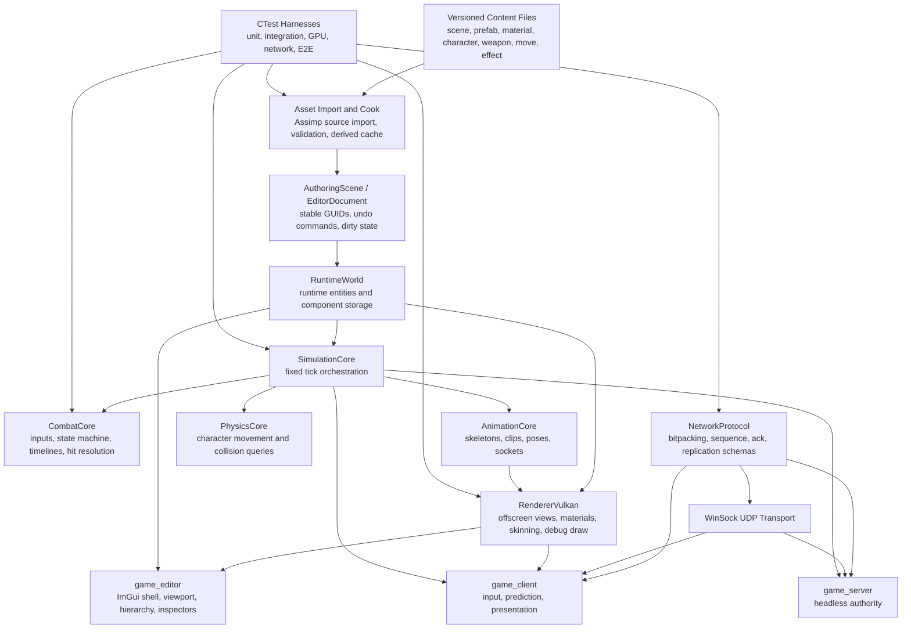

# 3D Multiplayer Action Combat Engine and Editor
## Technical Feature Specification and Regression Strategy

**Status:** Proposed implementation design  
**Primary platform:** Windows, MSVC Build Tools  
**Language:** C++20  
**Build:** CMake + Ninja + vcpkg manifest/toolchain  
**Rendering:** Vulkan + GLFW + GLM  
**Assets:** Assimp source import  
**Data:** nlohmann-json  
**Logging:** spdlog + fmt  
**Networking:** custom UDP/WinSock protocol  
**Test orchestration:** CTest

---

## 1. Purpose

This document specifies the engine, editor, content formats, combat runtime, rendering additions, networking changes, and regression infrastructure required to evolve the current Vulkan scene viewer into:

1. A reusable offline 3D editor that can preserve and open the current scene as a basic template without networking.
2. A game client for responsive multiplayer action combat.
3. A headless authoritative game server.
4. A data-driven authoring workflow for maps, characters, weapons, attachment slots, movesets, hit volumes, animation events, and effects.
5. A regression-tested toolchain in which CMake and CTest are the canonical build and test interfaces.

The design intentionally avoids a general-purpose engine rewrite. It extracts the useful runtime pieces already present, gives them explicit ownership boundaries, and adds only the authoring and runtime systems required by the game.

---

## 2. Current Baseline

The existing implementation already has several correct foundations:

- Scene content is declared outside the executable in JSON.
- Asset geometry is imported through Assimp.
- `ActorState` conceptually separates simulation state from rendering.
- Previous/current transforms support presentation interpolation.
- The renderer consumes presentation state rather than authoring gameplay truth.
- UDP protocol encoding is already isolated in `network_core`.
- CMake, Ninja, vcpkg, and CTest are already the intended durable toolchain.

The main constraints are:

- `vulkan_scene_viewer.cpp` owns too many unrelated responsibilities.
- `scene_core` currently mixes authored scene loading, render geometry generation, and combat movement rules.
- Meshes are flattened to unindexed triangles and lose submesh, material, skeleton, and animation structure.
- The current server relays client-authored transforms; it is not authoritative over movement or combat.
- There is no editor document model, undo/redo, asset registry, material system, texture binding, skeletal animation, attachment system, collision query service, or combat timeline.
- There is no stable regression harness around the current behavior.

The first implementation rule is therefore: **preserve existing behavior with characterization tests before extracting or replacing it.**

---

## 3. Product Goals

### 3.1 Required goals

- Open the existing bootstrap scene in a separate editor executable with networking disabled.
- Create a new scene from that bootstrap scene as a template.
- Place, select, move, rotate, scale, duplicate, color, and delete simple 3D shapes.
- Import and preview static and skeletal character/weapon models.
- Define named attachment sockets and equip weapon prefabs into compatible slots.
- Author and preview action-combat moves as tick-based timelines.
- Author startup, active, recovery, cancel, invulnerability, armor, hitbox, hurtbox, movement, and effect windows.
- Run combat in a deterministic headless harness and in a local editor preview.
- Run multiple game clients against a headless authoritative server.
- Preserve responsive local control through prediction and reconciliation rather than trusting client transforms.
- Detect regressions through CTest-owned unit, integration, GPU, network, and end-to-end tests.

### 3.2 Initial validation target

The first multiplayer validation target is four concurrent clients in one arena. The architecture must not hard-code that count. Higher session limits, interest management, and distributed hosting are later scaling concerns.

### 3.3 Non-goals for the first production slice

- A general-purpose DCC package or replacement for Blender/Maya.
- Photorealistic rendering, full terrain sculpting, global illumination, or a complete PBR pipeline.
- Skeleton retargeting across arbitrary rigs.
- Full deterministic rollback networking for the entire world.
- MMO-scale replication or persistence.
- Visual scripting.
- Console platform support.
- A plugin ABI.

---

## 4. Architectural Decisions

### AD-01: Split runtime libraries from executable hosts

There will be three primary hosts:

- `game_editor`: offline authoring and preview.
- `game_client`: player-facing rendering, input, prediction, networking, and presentation.
- `game_server`: headless authoritative simulation and replication.

The hosts share libraries; they do not share a monolithic application class.

### AD-02: Separate authoring state from runtime state

The editor owns an `EditorDocument` containing an `AuthoringScene`. Pressing Play creates a new `RuntimeWorld` from a snapshot/cook of the document. Simulation never mutates the authoring document directly.

This is required for reliable stop/reset behavior, undo/redo, deterministic preview, and future networked play-in-editor workflows.

### AD-03: Networking is an optional session service

Core simulation cannot call WinSock directly. It receives an `INetworkSession` implementation:

- `NullNetworkSession` for offline editor preview.
- `ClientNetworkSession` for a connected game client.
- `ServerNetworkSession` for the authoritative server.
- `LoopbackNetworkSession` and `FaultInjectingNetworkSession` for tests.

The editor should initially launch external client/server processes for networked tests rather than embedding the WinSock client inside the authoring process.

### AD-04: Data-driven gameplay assets use stable IDs and schema versions

Scenes, prefabs, materials, characters, weapons, movesets, moves, and effects must have:

- A stable GUID independent of file path.
- A human-readable logical ID.
- A `schemaVersion`.
- Explicit dependencies.
- Validation and migration support.

Runtime entity IDs and network entity IDs are not serialized as authored identities.

### AD-05: Combat timing is tick-based

The default simulation rate is 60 ticks per second. All gameplay windows are authored in integer ticks. Rendering may interpolate, but it cannot decide whether an attack is active, cancellable, invulnerable, or able to hit.

### AD-06: Server authority replaces transform relay

The target network model is:

- Clients send input commands tagged with client simulation ticks.
- The server validates and simulates those commands.
- The server sends authoritative snapshots and gameplay events.
- The local client predicts its own movement and eligible combat transitions.
- The client reconciles to server state and replays unacknowledged inputs.
- Remote actors are presented from an interpolation buffer.

The current snapshot relay remains temporarily as a compatibility path while the authoritative path is developed and tested.

### AD-07: Componentized world, not an engine-wide ECS rewrite

The code should use stable entities with typed components, but no immediate rewrite into a fully generic ECS is required. Hot combat state may remain in compact arrays keyed by runtime entity ID. The primary requirement is explicit ownership and query APIs, not a particular ECS library.

### AD-08: CMake is the canonical interface

Required commands are:

```text
cmake --preset msvc-debug
cmake --build --preset msvc-debug
ctest --preset msvc-debug
```

PowerShell scripts may wrap these commands for convenience, but no build, test, cook, or launch capability may exist only in `.ps1` files.

---

## 5. Target Architecture



### 5.1 Proposed CMake targets

| Target | Type | Responsibility | Must not depend on |
|---|---|---|---|
| `engine_base` | static library | IDs, clocks, result/error types, file utilities, logging helpers | GLFW, Vulkan, WinSock |
| `content_core` | static library | asset registry, schemas, validation, migrations, canonical serialization | renderer, transport |
| `scene_core` | static library | authoring/runtime scene structures, transforms, prefabs, world compilation | Vulkan, WinSock, combat rules |
| `input_core` | static library | action mappings, control profiles, device-neutral input frames | combat implementation |
| `animation_core` | static library | skeletons, clips, pose sampling, animation state, sockets | Vulkan, WinSock |
| `physics_core` | static library | collision world interface, character controller, queries | renderer, network transport |
| `combat_core` | static library | command buffer, move timelines, state transitions, hit resolution | Vulkan, GLFW, WinSock |
| `simulation_core` | static library | fixed-step world orchestration and event collection | platform windowing |
| `network_protocol` | static library | packet headers, bitpacking, message schemas, replication encoding | WinSock |
| `network_transport_winsock` | static library | sockets, endpoints, nonblocking send/receive | game rules, renderer |
| `renderer_core` | static library | renderer-facing scene snapshots, resource handles, debug draw API | game rules |
| `renderer_vulkan` | static library | Vulkan resources, pipelines, passes, uploads, viewport targets | WinSock |
| `platform_glfw` | static library | window lifecycle, keyboard/mouse callbacks | combat rules |
| `editor_core` | static library | document model, commands, selection, play session lifecycle | WinSock transport |
| `editor_ui` | static library | ImGui panels and editor interactions | authoritative server logic |
| `test_support` | static library | fake clock, world builders, loopback/fault transports, golden helpers | production hosts |
| `game_editor` | executable | editor host | server rendering assumptions |
| `game_client` | executable | connected player host | editor document mutations |
| `game_server` | executable | headless authority | Vulkan, GLFW, XInput |
| `content_validate` | executable | schema and dependency validation | windowing |
| `asset_cook` | executable | source import and derived-data generation | windowing |

### 5.2 Immediate ownership corrections

- Move render geometry generation out of `scene_core` into `renderer_core`/`content_core`.
- Move combat movement rules out of `scene_core` into `combat_core` or `simulation_core`.
- Split `network_core` into protocol and WinSock transport targets.
- Reduce `vulkan_scene_viewer.cpp` to temporary host composition, then replace it with `game_client`.
- Preserve the existing viewer as `legacy_viewer_smoke` until the editor and client pass equivalent regression scenarios.

### 5.3 Required host loops

#### Editor

```text
poll platform events
collect editor UI input
apply EditorCommand transactions to AuthoringScene
if Play is active:
    advance cloned RuntimeWorld at fixed ticks using NullNetworkSession
build render snapshot from AuthoringScene or PlayWorld
render scene into editor viewport texture
render editor UI
present
```

#### Game client

```text
poll platform and controller input
receive network packets
advance fixed local prediction ticks
send redundant input command frames
apply authoritative snapshots
reconcile and replay unacknowledged input
build interpolated presentation snapshot
render
present
```

#### Game server

```text
receive client packets
validate sessions and input commands
advance authoritative fixed ticks
resolve movement and combat
emit authoritative gameplay events
build/send snapshots and reliable control messages
sleep/yield until next tick deadline
```

### 5.4 Architecture regression requirements

- A link-time dependency test or CMake check must fail if `game_server` gains Vulkan, GLFW, or XInput dependencies.
- A headless simulation test must run without a window or GPU.
- An offline editor smoke test must run without opening a UDP socket.
- A legacy scene must produce equivalent actor spawn transforms and floor bounds before and after extraction.
- Fixed-step simulation must produce the same state hash regardless of render frame cadence.

---

## 6. World and Scene Model

### 6.1 Identity types

Use separate strong types:

```cpp
struct AssetGuid { std::array<std::byte, 16> value; };
struct ObjectGuid { std::array<std::byte, 16> value; };
struct RuntimeEntityId { std::uint32_t index; std::uint32_t generation; };
struct NetEntityId { std::uint32_t value; };
```

Requirements:

- `AssetGuid` identifies an asset across rename/move.
- `ObjectGuid` identifies an authored object within documents and prefab overrides.
- `RuntimeEntityId` is generation-checked and process-local.
- `NetEntityId` is allocated by the server and exists only during a session.
- Serialization must never silently reinterpret one ID class as another.

### 6.2 Minimum authored components

| Component | Required data |
|---|---|
| `Name` | display name |
| `Transform` | local position, normalized rotation, scale, optional parent GUID |
| `MeshRenderer` | mesh asset, material slots, visibility, shadow flag |
| `PrimitiveShape` | box/sphere/capsule/cylinder/plane parameters |
| `MaterialOverride` | base color and optional material asset |
| `Collider` | shape, dimensions, layer, mask, trigger/static/dynamic mode |
| `CharacterDefinitionRef` | character asset reference |
| `Animator` | skeleton/animation graph or clip state |
| `Combatant` | moveset, team, base stats, hurtbox set |
| `Attachment` | parent entity/socket, attached prefab, local offset |
| `SpawnPoint` | team, facing, enabled, tags |
| `WorldBounds` | playable bounds and optional kill height |
| `DirectionalLight` | direction, color, intensity |
| `CameraMarker` | editor/game preview camera settings |
| `EffectEmitter` | effect asset and activation mode |

### 6.3 Authoring scene versus runtime world

`AuthoringScene` prioritizes editability:

- Stable GUID maps.
- Parent/child hierarchy.
- Human-readable names.
- Optional values and unresolved references with diagnostics.
- Prefab instance overrides.
- Editor-only metadata.

`RuntimeWorld` prioritizes simulation and rendering:

- Dense component arrays.
- Resolved asset handles.
- Runtime and network IDs.
- Precomputed bounds and collision handles.
- No undo history or editor-only fields.

Compilation from authoring to runtime must be explicit and return structured diagnostics. Play cannot start when required references or schemas are invalid.

### 6.4 Scene file shape

```json
{
  "schemaVersion": 3,
  "assetGuid": "f4b7...",
  "logicalId": "scene.template.basic_render",
  "unitsPerMeter": 1.0,
  "coordinateSystem": "RH_Y_UP_NEG_Z_FORWARD",
  "dependencies": [
    "asset://mesh/test_character",
    "asset://material/editor_blue"
  ],
  "entities": [
    {
      "objectGuid": "9941...",
      "name": "Floor",
      "components": {
        "Transform": {
          "position": [0.0, 0.0, 0.0],
          "rotation": [0.0, 0.0, 0.0, 1.0],
          "scale": [1.0, 1.0, 1.0]
        },
        "PrimitiveShape": {
          "type": "box",
          "size": [20.0, 0.25, 20.0]
        },
        "MaterialOverride": {
          "baseColor": [0.15, 0.18, 0.22, 1.0]
        },
        "Collider": {
          "shape": "box",
          "layer": "world_static"
        }
      }
    }
  ]
}
```

### 6.5 Serialization requirements

- Reject unknown required enum values.
- Preserve unknown optional fields only when explicitly supported; otherwise fail loudly during development.
- Report errors with file, object GUID, component, and JSON pointer.
- Save through a temporary file followed by atomic replace.
- Emit deterministic key and array ordering where ordering is not semantically meaningful.
- Normalize asset paths and prohibit `..` escaping the content root.
- Include explicit migrations from every supported prior schema version.
- Never mutate source files during load.

### 6.6 Prefabs

A prefab is an authored entity hierarchy with its own stable object GUID namespace. Scene instances store:

- Prefab asset GUID.
- Instance root object GUID.
- Property overrides addressed by prefab object GUID + component + field path.
- Added/removed child overrides only after the base implementation is stable.

Initial scope should support transform, material, character, weapon, and move-reference overrides. Nested prefabs can be deferred until single-level prefab serialization is reliable.

### 6.7 Scene regression tests

**Unit**

- GUID parse/format round trips.
- Transform hierarchy composition, including nonuniform scale policy.
- Component defaulting and validation.
- Canonical serialization is byte-stable across repeated saves.
- Every migration transforms known old fixtures into the current canonical fixture.
- Invalid rotations, NaNs, duplicate GUIDs, missing parents, and cycles are rejected.

**Integration**

- Load the current `bootstrap.scene.json`, compile it to `RuntimeWorld`, and compare actor count, model references, world bounds, and initial transforms to a checked-in baseline.
- Save/reload a scene with every component and compare semantic equality.
- Instantiate a prefab twice and verify independent instance overrides.
- Rename/move an asset path while retaining the GUID and verify references still resolve.

**End-to-end**

- Launch editor with `--scene <fixture> --frames 5 --no-network`; require clean exit and no socket initialization log.
- Create a scene from the basic template through a scripted editor command stream, save it, reopen it, and verify the object graph.

---

## 7. Asset Registry, Import, and Cooking

### 7.1 Source and runtime separation

Maintain three categories:

```text
assets/source/       Original OBJ, FBX, PNG, etc.
assets/game/         Human-authored JSON assets and import settings.
assets/generated/    Derived binary data; ignored or managed as build artifacts.
```

Assimp remains a source importer. The renderer must not repeatedly parse arbitrary FBX/OBJ files at runtime after the cook path exists.

### 7.2 Asset registry

The registry maps:

```text
AssetGuid -> logical ID -> source path -> import settings -> derived artifact(s)
```

It must support:

- Stable GUID assignment.
- Dependency queries.
- Content hash and importer-version tracking.
- Dirty/out-of-date status.
- Reimport.
- Error and fallback assets.
- Runtime handle generation checking.
- Editor file watching with debouncing.

### 7.3 Internal mesh representation

Replace flattened triangles with an indexed mesh asset containing:

- Vertex positions.
- Vertex normals.
- UV0.
- Tangents when normal mapping is enabled.
- Up to four joint indices and normalized joint weights for the initial skinning path.
- 32-bit index buffer, with optional 16-bit optimization later.
- Submesh ranges.
- Material slot names.
- Local AABB and bounding sphere.
- Skeleton reference when skinned.
- Optional collision mesh reference.

The current flattened path may remain as an importer fallback but cannot be the canonical asset representation.

### 7.4 Import settings

Each imported model must record:

- Source asset path and content hash.
- Assimp importer version or engine importer revision.
- Unit scale.
- Axis conversion into the engine coordinate convention.
- Whether transforms are baked.
- Mesh merge policy.
- Normal/tangent generation policy.
- Skeleton root selection.
- Animation clip selection and naming.
- Material/texture import mapping.
- Collision generation mode.

### 7.5 Primitive assets

The editor must provide procedural:

- Plane.
- Box.
- Sphere.
- Capsule.
- Cylinder.

Each primitive must have deterministic vertex/index generation, valid normals/UVs, calculated bounds, and a compatible primitive collider. Primitive parameters stay authored; generated geometry may be cached.

### 7.6 Derived binary format

The initial cooker can write simple versioned binary blobs with a small header:

```text
magic | asset type | format version | source hash | payload size | payload
```

Do not serialize raw C++ object memory. Every integer width, alignment rule, and endianness assumption must be explicit.

### 7.7 Hot reload policy

- Material and texture changes may reload in place after the GPU has safe ownership.
- Static mesh changes replace resource handles at a frame boundary.
- Skeleton topology changes invalidate dependent animation/character assets and require preview restart.
- Move/effect JSON changes can reload at the next simulation reset; changing an active move definition mid-attack is prohibited.
- Server production mode does not hot reload.

### 7.8 Asset regression tests

**Unit**

- Primitive generation counts, winding, bounds, normals, and UV ranges.
- Import coordinate conversion fixtures.
- Weight normalization and rejection of invalid joint indices.
- Binary reader rejects truncation, bad magic, unsupported versions, overflow lengths, and malformed counts.
- Dependency graph detects cycles.

**Integration**

- Import fixed OBJ and FBX fixtures and compare a semantic manifest: node count, submesh count, index count, bounds, bones, and clips.
- Reimport unchanged content and verify identical derived hashes.
- Modify import settings and verify only dependent artifacts are rebuilt.
- Load a missing asset and verify the fallback resource is rendered while a structured diagnostic is emitted.

**Fuzz/property**

- Fuzz binary asset decoders and JSON import settings under AddressSanitizer.
- Generate random valid primitive parameters and assert finite bounds, indices within range, and normalized normals within tolerance.

**End-to-end**

- Run `asset_cook --content-root <fixture> --output <temp>` through CTest, then launch the client against the cooked output only.

---

## 8. Vulkan Renderer Evolution

### 8.1 Required rendering milestones

#### R0: Extract and preserve current renderer

- Move Vulkan instance/device/swapchain ownership out of the viewer host.
- Introduce RAII wrappers or explicit lifetime-owning classes.
- Keep triangle and line pipelines operational.
- Add deterministic command-line frame limit and hidden-window mode for smoke tests.

#### R1: Editor viewport rendering

The editor viewport must render to offscreen images rather than directly to the swapchain:

- Color attachment.
- Depth attachment.
- Integer object-ID attachment for picking.
- Resize/recreate on viewport panel size changes.
- Expose the color image to the UI renderer.
- Keep swapchain presentation as a separate final UI pass.

#### R2: Material and texture system

Minimum material features:

- Unlit vertex/base-color mode for editor primitives and debug assets.
- Lit base-color mode using ambient plus one directional light.
- Optional base-color texture.
- Alpha mode: opaque and masked; transparent blending can follow later.
- Per-material constants and texture handles.
- Fallback white texture and error material.

Use descriptor sets with a documented convention, for example:

```text
set 0: frame/view data
set 1: material textures and constants
set 2: object/skinning data
```

The exact binding strategy may evolve, but descriptor ownership, pool lifetime, and update timing must be centralized.

#### R3: Indexed meshes and instancing

- Bind vertex and index buffers.
- Draw submesh ranges with material slots.
- Store object transforms in a per-frame buffer rather than one push-constant-only draw model.
- Batch or instance repeated primitive meshes when practical.
- Preserve a debug draw API for lines, axes, bounds, sockets, hitboxes, and colliders.

#### R4: Skeletal skinning

- CPU evaluates animation pose.
- GPU receives final joint matrices per skinned object.
- Initial implementation uses linear blend skinning with up to four influences per vertex.
- The object-ID pass must use the same skinned vertex positions as the color pass.

### 8.2 Resource manager requirements

- Typed handles with generation counters.
- Staging uploads.
- Per-frame deferred destruction after fences confirm GPU completion.
- Swapchain-independent mesh/texture resources.
- Explicit device-loss/failure diagnostics where recoverable.
- No Vulkan handles stored in gameplay or scene components.
- Resource names passed to Vulkan debug utilities in development builds.

### 8.3 Picking

Use GPU object-ID picking for general meshes:

1. Render each selectable object’s editor selection ID to `R32_UINT`.
2. On click, copy one pixel to a small readback buffer.
3. Resolve editor selection ID to `ObjectGuid`.
4. Delay selection by the required GPU frame without blocking the device where possible.

CPU ray tests may be used as an immediate fallback for primitive-only scenes, but the object-ID path is required before arbitrary mesh authoring is considered complete.

### 8.4 Debug visualization

The renderer must support toggles for:

- World grid.
- Object bounds.
- Local axes.
- Skeleton bones.
- Attachment sockets.
- Character controller capsule.
- Static collision.
- Hurtboxes.
- Active/inactive hitboxes.
- Root-motion path.
- Network authoritative versus predicted transforms.
- Interpolation buffer samples.

### 8.5 Vulkan regression tests

**Unit without GPU**

- Descriptor layout reflection/metadata validation.
- Vertex format stride and offset assertions.
- Render-list sorting and submesh material resolution.
- Resource-handle generation and deferred-destruction queue logic.

**GPU integration**

- Create/destroy renderer, swapchain, offscreen viewport, materials, textures, indexed mesh, and skinned mesh under Vulkan validation.
- Enable synchronization validation in the dedicated validation preset.
- Resize the window and editor viewport repeatedly.
- Reload a texture and mesh while frames are in flight.
- Require zero validation errors and zero leaked live Vulkan objects at shutdown.

**Golden image**

- Render fixed scenes at fixed camera, resolution, shader version, and content hash.
- Compare exact hashes only for deterministic integer/object-ID targets.
- Compare color/depth output with a documented tolerance or perceptual metric.
- Store failed output, expected output, and a difference image as CI artifacts.
- Golden updates require an explicit command and code review; tests must never auto-accept output.

**End-to-end smoke**

```text
game_editor --scene basic_render.scene.json --frames 10 --validation --hidden-window
game_client --scene basic_render.scene.json --frames 10 --offline --validation --hidden-window
```

Both must exit successfully with no validation errors.

---

## 9. Editor Application

### 9.1 UI framework recommendation

Use Dear ImGui with the existing GLFW/Vulkan backends as the editor shell. Start with docking inside one operating-system window. Do not make detached platform windows a milestone requirement; each detached Vulkan viewport introduces additional surface/swapchain/resource-lifetime paths that are not necessary for the first usable editor.

The editor UI is a consumer of `EditorDocument`, renderer services, and asset services. It must not become the owner of runtime simulation rules.

### 9.2 Required panels

| Panel | Required functions |
|---|---|
| Main viewport | scene render, selection, gizmos, camera, debug overlays |
| Scene hierarchy | parent/child tree, rename, duplicate, delete, visibility |
| Inspector | component add/remove/edit, validation messages, asset references |
| Asset browser | logical IDs, type filter, search, drag/drop, import/reimport status |
| Toolbar | select/translate/rotate/scale, local/world, snapping, play/simulate/stop |
| Console | structured logs, severity/category filters, click-to-object/file |
| Content diagnostics | missing dependencies, schema errors, stale derived assets |
| Move timeline | tracks, tick ruler, phase windows, events, hitbox visualization |
| Character/weapon preview | animation clip, socket and attachment editing |
| Network diagnostics | connected state, ping, loss, tick offset, prediction error |
| Performance | CPU tick, render frame, draw count, upload count, packet rates |

### 9.3 Document lifecycle

Required operations:

- New empty scene.
- New from template.
- Open.
- Save.
- Save As.
- Revert from disk.
- Close with dirty-state prompt.
- Autosave recovery file.
- Recent documents.

The current scene must become a checked-in template such as:

```text
assets/game/templates/basic_render.scene.json
```

Selecting **New From Template → Basic Render Scene** clones the template into a new document with a new scene asset GUID and new object GUIDs where required.

### 9.4 Selection and hierarchy

- Single and multi-selection.
- Click selection in viewport.
- Hierarchy selection remains synchronized with viewport selection.
- Parent-child transforms.
- Focus camera on selection.
- Hide/show and lock/unlock in editor.
- Selection IDs are editor-session values; stable object identity remains `ObjectGuid`.

### 9.5 Transform gizmos

Required behavior:

- Translate, rotate, scale modes.
- World and local orientation.
- Axis and plane constraints.
- Grid and angle snapping.
- Numeric entry in inspector.
- Multi-selection pivot mode: median or active object.
- One drag gesture creates one undo transaction, not one command per mouse event.
- Negative and near-zero scale policy must be explicit; initial recommendation is to reject near-zero scale and warn on negative scale for skinned objects/colliders.

### 9.6 Undo/redo

Use command objects or serialized property patches with transactions:

```cpp
class IEditorCommand {
public:
    virtual ~IEditorCommand() = default;
    virtual void apply(EditorDocument&) = 0;
    virtual void revert(EditorDocument&) = 0;
    virtual std::string_view label() const = 0;
};
```

Requirements:

- Add/remove entity.
- Reparent.
- Add/remove component.
- Property edit.
- Transform drag transaction.
- Asset assignment.
- Attachment/socket edits.
- Timeline edits.
- Redo stack clears after a new edit.
- Save does not clear undo history; closing the document does.
- Commands cannot hold raw pointers into component storage.

### 9.7 Edit, simulate, and play modes

| Mode | Source world | Mutation policy | Network |
|---|---|---|---|
| Edit | `AuthoringScene` | editor commands only | none |
| Simulate | cloned `RuntimeWorld` | physics/simulation, editor camera | `NullNetworkSession` |
| Play Standalone | cloned `RuntimeWorld` | game input and camera | `NullNetworkSession` |
| Networked Play | external server/client processes | authoritative session | UDP |

On Stop, the play world is destroyed. Runtime changes are discarded unless a later explicit “apply selected runtime values” feature is added.

### 9.8 Editor camera

- Orbit, pan, dolly, fly, and focus-selection controls.
- Perspective/orthographic toggle.
- Configurable movement speed.
- Input routing must respect UI capture; typing in a field cannot move the game camera.
- Game camera preview remains distinct from editor camera.
- Camera state may be stored as editor-only metadata, not runtime gameplay content.

### 9.9 Map authoring minimum slice

The first map workflow must support:

1. Create a scene from the basic template.
2. Place primitives and imported static meshes.
3. Transform them with snapping.
4. Assign base colors/materials.
5. Generate or assign colliders.
6. Place spawn points and world bounds.
7. Mark kill volumes or kill height.
8. Save and validate.
9. Launch standalone play.
10. Launch a local multi-client test through an editor command that delegates to CMake-built executables or the test runner.

Terrain sculpting, CSG, baked lighting, and navigation mesh authoring are not prerequisites.

### 9.10 Editor regression tests

**Unit**

- Every editor command applies and reverts to a semantically identical document.
- Command transaction coalescing for transform drags and text edits.
- Selection remains valid or clears after deletion/reload.
- Dirty-state transitions for edit, save, undo, redo, and revert.
- Input routing between UI, editor camera, and play controls.

**Integration**

- Create an entity, add components, transform it, assign material, save, reopen, and compare.
- Undo and redo a mixed command sequence including hierarchy changes.
- Enter Play, advance ticks, Stop, and verify the authoring scene is unchanged.
- Reimport an asset while selected and verify selection and document references remain valid.
- Resize/dock panels while the Vulkan viewport target is recreated under validation.

**End-to-end**

Support a deterministic editor command script, for example:

```json
[
  { "command": "newFromTemplate", "template": "scene.template.basic_render" },
  { "command": "createPrimitive", "type": "box", "name": "Platform" },
  { "command": "setTransform", "object": "Platform", "position": [0, 1, 0], "scale": [3, 0.5, 3] },
  { "command": "setBaseColor", "object": "Platform", "value": [0.2, 0.5, 0.9, 1.0] },
  { "command": "saveAs", "path": "output/test_arena.scene.json" },
  { "command": "playTicks", "ticks": 120 },
  { "command": "stop" }
]
```

The editor executes this through `--command-script`, writes a structured result file, and exits. This gives CI process-level coverage without UI coordinate automation.

---

## 10. Physics, Character Movement, and Collision Queries

### 10.1 Recommendation

Introduce `physics_core` behind engine-owned interfaces and use Jolt Physics as the initial implementation rather than expanding ad hoc floor/AABB logic into a complete physics engine. The vcpkg manifest should pin the selected version through the repository baseline.

Gameplay code must depend on interfaces such as:

```cpp
struct ShapeCastHit {
    RuntimeEntityId entity;
    float fraction;
    glm::vec3 position;
    glm::vec3 normal;
};

class IPhysicsWorld {
public:
    virtual ~IPhysicsWorld() = default;
    virtual std::optional<ShapeCastHit> castShape(const ShapeCastQuery&) const = 0;
    virtual void overlapShape(const OverlapQuery&, std::vector<OverlapHit>& out) const = 0;
    virtual CharacterMoveResult moveCharacter(const CharacterMoveRequest&) = 0;
};
```

### 10.2 Required collision layers

At minimum:

- `world_static`
- `world_dynamic`
- `character_body`
- `character_hurtbox`
- `combat_hitbox_query`
- `projectile`
- `trigger`
- `editor_only`

Collision masks must be data-driven and validated. Combat hitboxes should generally use explicit overlap/sweep queries rather than creating transient rigid bodies.

### 10.3 Character controller

Requirements:

- Capsule-based movement.
- Ground detection and stable ground normal.
- Step height and slope limit.
- Gravity and falling.
- Collision sliding.
- Depenetration with bounded correction.
- Optional movement lock/scale from active combat move.
- Facing independent from movement where required by combat.
- Teleport operation for spawn/reconciliation.
- Explicit fixed-tick input and result types.

The character controller position belongs to authoritative simulation. Render transforms interpolate from controller output.

### 10.4 Combat collision

Support authored primitive volumes:

- Sphere.
- Capsule.
- Box.

Hit volumes can be bound to:

- Character root.
- Skeleton bone.
- Named socket.
- Weapon attachment socket.

For fast weapon motion, sample a swept volume between previous and current tick transforms. Do not rely only on overlap at the final pose.

### 10.5 Hit ordering

When multiple collisions occur during one simulation tick, resolve them in stable order. A suitable key is:

```text
attacker NetEntityId / RuntimeEntityId
move instance sequence
hitbox track ID
victim entity ID
contact sub-index
```

This prevents container iteration order or physics callback scheduling from changing results.

### 10.6 Physics regression tests

**Unit**

- Layer/mask compatibility matrix.
- Character slope, step, slide, gravity, and depenetration fixtures.
- Stable hit ordering independent of insertion order.
- Shape transform from root, bone, socket, and attachment.
- Swept hitbox catches a target crossed between ticks.

**Integration**

- Run a character through the basic template floor and bounds for fixed input sequences.
- Equip a weapon, animate a swing, and compare the resulting ordered hit event trace.
- Reconcile/teleport a character and verify no stale contacts or explosive depenetration.
- Load a map’s primitive colliders and compare physics bounds to authored bounds.

**Property/soak**

- Randomized valid capsule movement must never produce NaN/Inf transforms.
- Run repeated collision insertion orders and require identical state/event hashes.
- Simulate thousands of fixed ticks in a small arena under AddressSanitizer.

---

## 11. Skeletal Animation and Character Assets

### 11.1 Character asset

A character asset references:

- Render mesh and skeleton.
- Default animation set or graph.
- Character controller dimensions.
- Hurtbox set.
- Named equipment slots.
- Default moveset.
- Base combat attributes.
- Optional default weapon/loadout.

Example:

```json
{
  "schemaVersion": 1,
  "assetGuid": "a132...",
  "logicalId": "character.fighter_a",
  "mesh": "asset://mesh/fighter_a",
  "skeleton": "asset://skeleton/fighter_a",
  "animationSet": "asset://animset/fighter_a",
  "controller": {
    "radius": 0.38,
    "height": 1.75,
    "stepHeight": 0.3,
    "slopeLimitDegrees": 50.0
  },
  "moveset": "asset://moveset/fighter_a_sword",
  "slots": ["hand_r", "hand_l", "back"],
  "hurtboxSet": "asset://hurtboxes/fighter_a_default"
}
```

### 11.2 Skeleton data

- Bone name and stable bone index.
- Parent index.
- Reference local transform.
- Inverse bind matrix.
- Skeleton asset GUID and format version.
- Validation for one root, acyclic hierarchy, finite matrices, and unique names.

Initial clips are skeleton-specific. General retargeting is deferred.

### 11.3 Animation clips

Each clip contains:

- Duration.
- Source sample rate.
- Per-bone translation/rotation/scale tracks.
- Looping flag.
- Extracted root-motion curve or explicit no-root-motion policy.
- Named animation events.
- Optional authored trim range.

Runtime sampling must be by simulation time/tick, not render frame count.

### 11.4 Animation state

Initial runtime support:

- Play named clip.
- Loop/non-loop.
- Crossfade over a tick duration.
- Playback rate.
- Root-motion enable/scale.
- Move-driven clip selection.
- Locomotion idle/move blend may initially be a simple two-state blend.

A complex visual animation graph editor is not a prerequisite for the combat timeline editor. Combat state selects named animation states through a stable interface.

### 11.5 Root motion

Root motion must be split into:

- **Simulation delta:** applied by the character controller and subject to collision/server authority.
- **Visual residual:** optional correction used to align the rendered mesh with the controller.

Never advance authoritative position by reading the final rendered bone matrix. Root-motion curves are sampled in simulation and reconciled like other movement.

### 11.6 Pose evaluation

A practical first path:

1. Combat state chooses clip and normalized/tick position.
2. `animation_core` samples local bone transforms.
3. Bone hierarchy produces model-space transforms.
4. Socket transforms are derived.
5. Hit/hurt volumes consume simulation pose transforms.
6. Skin matrices are uploaded to the renderer.
7. Renderer interpolates presentation only where doing so cannot change gameplay events.

For strict synchronization, the combat query pose for a tick must be reproducible headlessly without Vulkan.

### 11.7 Animation regression tests

**Unit**

- Clip time wrapping/clamping.
- Quaternion interpolation normalization.
- Hierarchy pose composition.
- Crossfade endpoint correctness.
- Root-motion extraction and accumulation.
- Socket transform from known bone fixture.
- Invalid skeleton hierarchy rejection.

**Golden data**

- Sample selected bones at fixed clip ticks and compare transforms within tolerance.
- Store root-motion curves and animation event traces as canonical fixtures.

**Integration**

- Import a skeletal FBX fixture, cook it, sample a clip, attach a weapon, and verify socket/weapon world transforms at selected ticks.
- Run the same pose test with and without renderer linked; results must match.
- Reload a clip after stopping preview and verify dependent runtime resources refresh.

**GPU**

- Render a fixed skinned pose and compare a golden image.
- Verify object-ID picking follows skinned geometry.

---

## 12. Attachment Slots, Weapons, and Equipment

### 12.1 Socket definition

Sockets are named transforms relative to a skeleton bone:

```json
{
  "name": "hand_r",
  "bone": "RightHand",
  "localPosition": [0.02, 0.0, 0.0],
  "localRotation": [0.0, 0.7071, 0.0, 0.7071],
  "localScale": [1.0, 1.0, 1.0],
  "compatibilityTags": ["weapon.one_hand", "weapon.sword"]
}
```

Sockets can exist in skeleton metadata or a character-specific socket set. Character-specific overrides are preferable when the same skeleton is reused with differently proportioned meshes.

### 12.2 Weapon asset

A weapon asset references:

- Prefab/mesh and material.
- Equipment compatibility tags.
- Primary attachment transform.
- Optional secondary-hand grip socket.
- Weapon hit volume definitions.
- Trail sockets/points.
- Moveset additions or replacement.
- Gameplay attributes such as reach and category.

```json
{
  "schemaVersion": 1,
  "logicalId": "weapon.training_sword",
  "assetGuid": "7c24...",
  "prefab": "asset://prefab/training_sword",
  "categoryTags": ["weapon", "weapon.sword", "weapon.one_hand"],
  "equipSlot": "hand_r",
  "gripOffset": {
    "position": [0.0, 0.0, 0.0],
    "rotation": [0.0, 0.0, 0.0, 1.0]
  },
  "combatProfile": "asset://weaponcombat/training_sword",
  "trail": {
    "baseSocket": "trail_base",
    "tipSocket": "trail_tip"
  }
}
```

### 12.3 Runtime attachment

An attachment instance stores:

- Parent character entity.
- Parent socket ID.
- Attached child entity.
- Local grip offset.
- Equipment instance ID.
- Replicated weapon asset ID.

The child world transform is derived each simulation/presentation update. The weapon’s mesh transform and combat query transforms use the same socket chain.

### 12.4 Editor workflow

- Select character preview.
- Display skeleton and sockets.
- Add/rename/delete socket.
- Choose parent bone.
- Transform socket with gizmo/numeric fields.
- Drag a weapon asset into a compatible slot.
- Preview animation and inspect grip alignment.
- Optionally align a secondary grip to the off-hand, without requiring full IK in the initial milestone.
- Save socket set or character override.

### 12.5 Replication

The server authoritatively controls equipment changes. Reliable equipment messages contain:

- Character net entity.
- Equipment slot.
- Weapon asset network dictionary ID.
- Equipment instance sequence.
- Effective server tick.

Snapshots include enough equipment state for late joiners.

### 12.6 Attachment regression tests

**Unit**

- Compatibility tag matching.
- Socket transform chain.
- Equip/unequip state transitions.
- Duplicate slot and missing bone validation.
- Stable serialization of socket offsets.

**Integration**

- Equip the training sword, play a known clip, and compare weapon base/tip positions at fixed ticks.
- Change weapon material and verify attachment entity remains stable.
- Equip on server and verify all clients resolve the same weapon asset and slot.
- Late join after equip and verify the weapon is visible and combat profile active.

**End-to-end**

- Launch two clients, equip a weapon on client A through an allowed command, attack client B, and verify both clients receive one matching equipment event and one authoritative hit event.

---

## 13. Combat Language and Moveset Authoring

### 13.1 Combat model

The combat system is a fixed-tick state machine driven by semantic input commands. Raw GLFW/XInput codes never appear in move definitions.

Core runtime state:

```cpp
struct CombatActorState {
    RuntimeEntityId entity;
    CombatStateId state;
    MoveId activeMove;
    std::uint32_t moveInstanceSequence;
    std::uint16_t moveTick;
    Facing facing;
    bool grounded;
    glm::vec3 velocity;
    ResourceValues resources;
    TagSet stateTags;
    TickCount hitstopRemaining;
    TickCount stunRemaining;
    InputCommandBuffer commandBuffer;
    HitRegistry hitsAppliedThisMove;
};
```

The state required for authoritative gameplay must be serializable into a compact snapshot or state hash. Presentation-only values such as trail particle positions are excluded.

### 13.2 Input actions and command buffer

Define semantic actions such as:

- `move_x`, `move_y`
- `camera_x`, `camera_y`
- `light_attack`
- `heavy_attack`
- `special`
- `guard`
- `dodge`
- `jump`
- `lock_on`
- `interact`

At each simulation tick, device input resolves to an `InputFrame`:

```cpp
struct InputFrame {
    SimulationTick tick;
    std::uint32_t heldBits;
    std::uint32_t pressedBits;
    std::uint32_t releasedBits;
    std::int8_t moveX;
    std::int8_t moveY;
    std::int8_t aimX;
    std::int8_t aimY;
};
```

Requirements:

- Configurable input buffering measured in ticks.
- Press, release, hold, double-tap, and directional conditions.
- Direction interpretation policy: camera-relative, actor-relative, or target-relative.
- Deterministic command matching priority.
- Input profile hot reload changes bindings/tuning, not active move definitions.
- Client sends semantic `InputFrame` data, not platform key codes.

### 13.3 Move definition

A move must define:

- Stable move ID and display name.
- Required actor/weapon tags.
- Input command and priority.
- Animation state/clip.
- Total tick duration or phase durations.
- Startup, active, and recovery regions.
- Root-motion or movement curve.
- Facing/turn policy.
- Hitbox tracks.
- Hurtbox override tracks.
- Invulnerability/armor tracks.
- Cancel windows and allowed target tags/moves.
- Resource costs and gains.
- Hit reaction data.
- Events for VFX, sound, trails, camera, and diagnostics.
- Prediction policy.

Example:

```json
{
  "schemaVersion": 2,
  "logicalId": "move.sword.light_1",
  "assetGuid": "6b85...",
  "requiredTags": ["weapon.sword", "state.grounded"],
  "input": {
    "action": "light_attack",
    "trigger": "pressed",
    "bufferTicks": 6,
    "priority": 100
  },
  "animation": {
    "state": "attack_light_1",
    "playbackRate": 1.0,
    "rootMotion": "authoritative"
  },
  "durationTicks": 34,
  "phases": [
    { "name": "startup", "begin": 0, "end": 9 },
    { "name": "active", "begin": 9, "end": 13 },
    { "name": "recovery", "begin": 13, "end": 34 }
  ],
  "movement": [
    { "begin": 4, "end": 12, "curve": "asset://curve/sword_light_lunge" }
  ],
  "hitboxes": [
    {
      "trackId": "blade_primary",
      "begin": 9,
      "end": 13,
      "shape": "capsule",
      "fromSocket": "trail_base",
      "toSocket": "trail_tip",
      "radius": 0.09,
      "sweep": true,
      "hitPolicy": "once_per_target",
      "damage": 12,
      "hitstunTicks": 18,
      "hitstopAttackerTicks": 4,
      "hitstopVictimTicks": 6,
      "knockback": [0.0, 1.5, 4.0]
    }
  ],
  "cancels": [
    {
      "begin": 16,
      "end": 25,
      "on": "hit_or_block",
      "allowTags": ["move.chain.light_2", "move.dodge"]
    }
  ],
  "events": [
    { "tick": 8, "type": "effect", "asset": "asset://effect/sword_whoosh" },
    { "tick": 9, "type": "trail_begin", "id": "blade" },
    { "tick": 13, "type": "trail_end", "id": "blade" }
  ]
}
```

Tick interval convention must be consistent. Recommended convention is half-open ranges `[begin, end)`, so a track beginning at 9 and ending at 13 is active on ticks 9, 10, 11, and 12.

### 13.4 Move phases and state tags

Phase names are authoring aids; the runtime consumes ranges and tags. Typical tags:

- `state.grounded`
- `state.airborne`
- `state.attacking`
- `state.blocking`
- `state.dodging`
- `state.stunned`
- `state.dead`
- `state.can_turn`
- `state.can_move`
- `state.invulnerable.strike`
- `state.armor.light`
- `move.chain.light_1`

Use interned/registered tag IDs at runtime, with duplicate and unknown-tag validation at content load.

### 13.5 Cancel model

A cancel rule contains:

- Tick window.
- Trigger condition: whiff, hit, block, always, resource threshold, grounded, etc.
- Allowed destination move IDs or tags.
- Optional input buffer extension.
- Resource cost.
- Priority.

Validation must reject:

- Ranges outside move duration.
- Empty destination sets.
- Unknown tags/moves.
- Impossible resource costs when statically knowable.
- Cycles that create zero-tick transitions.

### 13.6 Hit and hurt model

A hit event includes:

```cpp
struct CombatHitEvent {
    SimulationTick tick;
    RuntimeEntityId attacker;
    RuntimeEntityId victim;
    MoveId move;
    std::uint32_t moveInstanceSequence;
    HitboxTrackId hitbox;
    glm::vec3 contactPosition;
    glm::vec3 contactNormal;
    DamageValue damage;
    HitReactionId reaction;
    PredictionEventId eventId;
};
```

Requirements:

- Per-move-instance hit registry prevents unintended repeat hits.
- Multi-hit moves explicitly define reset cadence or hit groups.
- Team/friendly-fire filters.
- Guard direction and block result if guarding is implemented.
- Invulnerability and armor evaluated before damage.
- Stable simultaneous-hit policy: trade, priority, clash, or mutual cancellation, configured by tags/rules.
- Death/defeat state is server authoritative.

### 13.7 Hitstop and stun

The global server tick never stops. Hitstop freezes or constrains the affected actor simulation states for authored tick counts. Define separately:

- Attacker hitstop.
- Victim hitstop.
- Hitstun.
- Blockstun.

During hitstop:

- Network receive/send continues.
- Input may continue buffering according to policy.
- Presentation may apply camera/effect events.
- Physics must not advance a frozen actor through root motion.

### 13.8 Movement and facing tracks

Move movement data should support:

- Root-motion delta.
- Authored scalar/curve along actor forward.
- Explicit 3D local curve.
- Velocity impulse.
- Movement lock or input scaling.
- Turn rate or facing lock.

The character controller resolves movement against collision. The move timeline requests motion; it does not set world position directly.

### 13.9 Combat event stream

`combat_core` emits an ordered event stream:

- Move started/ended.
- Phase entered.
- Hitbox activated/deactivated.
- Hit confirmed/blocked/armored.
- Damage applied.
- Stun began/ended.
- Equipment event.
- Effect/audio/camera cue.

Events have deterministic IDs derived from actor, move instance, track, and tick. Presentation uses these IDs to deduplicate predicted and confirmed events.

### 13.10 Moveset

A moveset contains:

- List of move assets.
- Entry/default locomotion states.
- Global command priorities.
- Weapon/category requirements.
- Shared resource rules.
- Optional stance-specific move groups.

It is compiled into lookup tables at load time. Runtime command matching must not repeatedly scan JSON structures.

### 13.11 Combat editor timeline

The move editor must provide:

- Tick ruler and configurable zoom.
- Startup/active/recovery background regions.
- Tracks for animation, movement, hitboxes, hurtboxes, invulnerability, armor, cancels, and events.
- Drag/resize with snapping to integer ticks.
- Numeric property inspector.
- Current tick scrubber.
- Play/pause/step one tick/reset.
- Loop selected range.
- 3D hitbox and root-motion visualization in character preview.
- Attacker and configurable dummy target.
- Event log and state inspector.
- Validation messages linked to track/range.
- Save as a single undoable transaction per drag/edit.

### 13.12 Combat test arena

Provide a checked-in test scene with:

- Flat collision floor.
- Two to four spawn points.
- Static range markers.
- Configurable dummy target.
- Damage/stun/state overlay.
- Record/replay input controls.
- Network condition controls in development builds.

### 13.13 Combat regression tests

**Unit**

- Half-open tick range semantics at every boundary.
- Startup/active/recovery transitions.
- Input buffering, priority, hold/release, and directional command matching.
- Cancel conditions on whiff/hit/block.
- Resource cost and refund behavior.
- Hit registry once-per-target and intentional multi-hit reset.
- Invulnerability, armor, guard, damage, stun, hitstop, and death transitions.
- Stable simultaneous-hit resolution.
- Move validator rejects invalid ranges, references, and zero-tick cycles.
- Event IDs remain stable and unique for a move instance.

**Golden simulation traces**

A scenario fixture contains initial world state, per-tick input frames, and expected ordered events/state hashes:

```json
{
  "scenario": "sword_light_hits_idle_target",
  "ticks": 90,
  "inputs": [
    { "tick": 1, "actor": "attacker", "press": ["light_attack"] }
  ],
  "expectedEvents": [
    { "tick": 1, "type": "move_started", "move": "move.sword.light_1" },
    { "tick": 10, "type": "hit", "victim": "target", "damage": 12 },
    { "tick": 35, "type": "move_ended" }
  ],
  "expectedFinalStateHash": "..."
}
```

Golden traces are the primary regression mechanism for the combat language. A changed trace requires an intentional review explaining whether the balance/content change is expected.

**Integration**

- Animation pose, socket transform, hitbox query, and damage resolution for representative moves.
- Move transitions remain identical at render rates of 30, 60, 144, and irregular frame cadence.
- Offline editor preview and headless simulation produce matching event/state traces.
- Hot-reloaded move content takes effect only after reset.

**Property/fuzz**

- Generate valid move timelines and assert state always exits or loops only through declared behavior.
- Random input streams cannot produce invalid state IDs, negative resources unless allowed, NaN transforms, or duplicate deterministic event IDs.
- Fuzz move JSON and compiled move binary readers under AddressSanitizer.

**End-to-end**

- Run two clients and server; execute a fixed attack scenario; compare the server event trace and final client authoritative states.
- Repeat under configured latency, jitter, packet loss, duplication, and reordering.
- Verify a predicted hit effect is deduplicated when confirmed and cancelled/faded if rejected.

---

## 14. Effects and Combat Presentation

### 14.1 Separation from gameplay

Effects consume combat events. Effects cannot apply damage, change invulnerability, or determine hits. An effect asset may request visual/audio/camera actions only.

### 14.2 Initial effect primitives

- Spawn mesh with transform/lifetime.
- Billboard particle burst.
- Continuous particle emitter.
- Weapon trail between two sockets.
- Color/size/alpha over lifetime.
- Initial velocity, spread, drag, and gravity.
- Point flash or emissive mesh where supported.
- Camera shake for the local view.
- Screen flash.
- Decal is optional after texture/material support is stable.
- Sound event interface may be present before an audio backend exists; it should log or no-op in headless mode.

### 14.3 Effect definition

```json
{
  "schemaVersion": 1,
  "logicalId": "effect.sword_hit_light",
  "assetGuid": "18de...",
  "durationTicks": 24,
  "nodes": [
    {
      "id": "spark_burst",
      "type": "particle_burst",
      "tick": 0,
      "count": 18,
      "material": "asset://material/hit_spark",
      "lifetimeTicks": [8, 16],
      "speed": [2.0, 6.0]
    },
    {
      "id": "camera",
      "type": "camera_shake",
      "tick": 0,
      "durationTicks": 5,
      "amplitude": 0.15
    }
  ]
}
```

### 14.4 Prediction and deduplication

Every effect spawn caused by gameplay must carry `PredictionEventId`:

- Local predicted event spawns immediately when allowed.
- Authoritative confirmation with the same ID does not spawn a duplicate.
- Rejection marks the predicted effect for cancellation or short fade.
- Remote actors normally spawn from authoritative events only.

Cosmetic loop effects use separate lifecycle IDs so begin/end messages remain paired.

### 14.5 Pooling and limits

- Fixed or growable pools by effect type.
- Per-effect and global particle limits.
- Deterministic overflow policy for testability, such as drop oldest cosmetic instance.
- Effects must not allocate unbounded memory per frame.
- Headless server does not instantiate effect objects; it only emits gameplay events.

### 14.6 Effect regression tests

**Unit**

- Effect timeline scheduling.
- Prediction deduplication and rejection.
- Trail begin/end pairing.
- Pool limit and overflow policy.
- Effect parser validation.

**Integration**

- Combat hit event creates expected effect spawn commands at the expected transform.
- Weapon trail samples the same sockets used by combat visualization.
- Reset/stop clears all preview effects and returns pools to baseline.

**GPU/golden**

- Fixed-seed particle burst at a fixed tick and camera produces a tolerance-based golden image.
- Effect creation/destruction under Vulkan validation produces no lifetime errors.

---

## 15. Networking and Multiplayer Authority

### 15.1 Migration stages

#### N0: Characterize current relay

Keep current connect/disconnect, snapshot encode/decode, fan-out, and late-join behavior. Add exact packet-vector tests and process-level relay tests before changing the protocol.

#### N1: Versioned packet envelope

Introduce a common packet header:

```text
magic
protocol version
packet type/channel
session ID
sender connection ID
packet sequence
latest received sequence
ack bitfield
sender simulation tick
payload bit length
```

The decoder must validate all lengths before reading payload fields.

#### N2: Reliable control and unreliable state channels

Logical channels:

- Reliable ordered: connect, accept/reject, spawn/despawn, asset dictionary, equipment, scene/session metadata.
- Unreliable sequenced: world snapshots.
- Unreliable redundant: client input frames, where each packet includes several recent frames.
- Optional reliable unordered: larger content/session messages if needed.

Do not implement reliability by blocking the simulation thread. Maintain resend queues with bounded memory and timeouts.

#### N3: Authoritative input simulation

- Client sends input frames.
- Server maps connection to controlled entity.
- Server validates tick windows and command rates.
- Server simulates movement/combat.
- Transform snapshots from clients are no longer accepted as truth.

#### N4: Prediction and reconciliation

Client stores:

- Predicted state per local tick.
- Input frames not yet acknowledged by authoritative state.
- Last authoritative server state/tick.

On snapshot:

1. Restore local authoritative state at server-confirmed tick.
2. Remove acknowledged inputs.
3. Replay remaining inputs through the same simulation functions.
4. Apply bounded presentation correction rather than snapping unless error exceeds threshold.

#### N5: Lag-aware hit validation

For melee, maintain a bounded history of authoritative character transforms/hurtbox poses. The server may evaluate an attack against a capped historical tick derived from client input timing. This is optional until baseline authoritative combat is stable and must be guarded against client-provided timestamps outside the allowed window.

### 15.2 Network entity and asset dictionaries

- Server allocates `NetEntityId` with generation or session uniqueness.
- Reliable spawn message maps net entity to character/prefab asset dictionary IDs.
- Session asset dictionary maps compact integer IDs to agreed asset GUIDs/content versions.
- A client with missing/incompatible required content is rejected with a structured reason.
- Late join receives session metadata, dictionary, existing spawns/equipment, then a current snapshot baseline.

### 15.3 Snapshot contents

Initial authoritative snapshot for relevant actors:

- Server tick.
- Net entity ID.
- Quantized position, rotation/facing, and velocity.
- Grounded/movement state.
- Active combat state/move and move tick.
- Health/resources/stun/hitstop as required.
- Equipment summary.
- Last processed input tick for the owning client.

Snapshots may begin as full state and move to acknowledged-baseline delta compression after correctness is established.

### 15.4 Interpolation

Remote actors render from an interpolation buffer behind estimated server time. Requirements:

- Ordered insertion by server tick.
- Drop duplicate/obsolete samples.
- Interpolate position, rotation, animation progression, and selected presentation values.
- Bounded extrapolation only when the buffer underruns.
- Debug graph of buffer depth and extrapolation.
- Teleport flag bypasses interpolation.

### 15.5 Server validation

The server must reject or clamp:

- Inputs too far in the future or past.
- Input rates above protocol limits.
- Impossible move transitions.
- Insufficient resource use.
- Movement exceeding controller/move constraints.
- Equipment not owned/allowed.
- Client-authored damage or hit confirmations.
- Invalid packet enums, counts, IDs, and lengths.

### 15.6 Packet size and fragmentation

Set a conservative application datagram budget and reject/segment messages that exceed it. Do not rely on IP fragmentation for routine snapshots. Log packet-type histograms and maximum encoded bit lengths in tests.

### 15.7 Time, sequence, and wrap handling

- Simulation tick and packet sequence wrap behavior must use explicit modular comparison helpers.
- Tests must cover values around wrap boundaries.
- Use monotonic clocks for timeouts and latency estimates.
- No network test may depend on wall-clock date/time.

### 15.8 Network fault injection

`FaultInjectingNetworkSession` or a UDP proxy must support deterministic seeded:

- Latency.
- Jitter.
- Packet loss.
- Duplication.
- Reordering.
- Burst loss.
- Bandwidth cap.
- Payload bit corruption for decoder robustness tests only.

The seed and fault configuration must appear in failure logs.

### 15.9 Network regression tests

**Unit**

- Golden bitpacked packet vectors for every message version.
- Encode/decode round trip at min/max values.
- Quantization error bounds.
- Sequence and tick wrap comparisons.
- Ack bitfield behavior.
- Reliable resend/ack/timeout queue state.
- Decoder rejects truncated, oversized, unknown-version, invalid-enum, and invalid-count packets.
- Snapshot interpolation buffer insertion and sampling.
- Reconciliation replay of a fixed input sequence.

**Fuzz**

- Feed arbitrary datagrams into every decoder under AddressSanitizer.
- Mutation-fuzz known valid packets.
- Fuzz reliable-channel state transitions with reordered/lost packet events.

**In-process integration**

- Client/server simulation through memory transport.
- Spawn, move, equip, attack, damage, despawn, late join, disconnect, reconnect.
- Compare authoritative server trace to reconciled client state.
- Repeat with deterministic fault injection.

**Process end-to-end**

CTest fixture starts `game_server --port 0 --ready-file <temp>`. The server writes the selected ephemeral port and session token only after it is accepting packets. Test clients then start with that data. No arbitrary sleeps are allowed.

Required scenarios:

1. Two clients connect, move, and observe each other.
2. Late join receives current world and equipment.
3. One client disconnects cleanly; the other receives despawn.
4. One client terminates without disconnect; timeout removes it.
5. Four clients execute scripted inputs for a fixed number of ticks.
6. Attack prediction/reconciliation under latency and loss.
7. Server rejects malformed packets without crashing or corrupting other sessions.
8. Client/server protocol version mismatch returns a clear rejection.

**Soak**

- Multi-client loopback session for a configured duration/tick count.
- Assert bounded resend queues, stable memory, no missed authoritative tick budget on the designated CI host, and no divergence in scripted actors.

---

## 16. Input System

### 16.1 Separation of bindings and actions

Keep control-profile JSON and hot reload, but split it into:

- Device binding profile: GLFW keyboard/mouse and XInput inputs to semantic actions.
- Gameplay input configuration: dead zones, curves, repeat/double-tap timing, buffering.
- Runtime `InputFrame`: compact tick-aligned semantic state.

`input_core` should expose device-neutral action IDs. Platform adapters resolve GLFW/XInput codes and feed normalized samples.

### 16.2 Input contexts

Required contexts:

- Editor global shortcuts.
- Editor viewport camera.
- Game/menu UI.
- Gameplay.
- Move-editor preview.

Contexts define priority and consumption. A text field or active gizmo must prevent gameplay actions from receiving the same input unless explicitly allowed.

### 16.3 Controller requirements

- XInput connect/disconnect detection.
- Left/right stick dead zones and normalized values.
- Trigger thresholds.
- Button press/release edges.
- Optional vibration interface driven by presentation events.
- Keyboard/mouse and controller can be switched without changing move definitions.

### 16.4 Input regression tests

- Binding profile schema and hot-reload failure fallback.
- Key/button edge detection across frame and simulation tick boundaries.
- Dead-zone and response-curve numeric fixtures.
- Context priority/consumption.
- Input sampling at irregular render cadence yields the intended ordered tick frames.
- Serialized/replayed `InputFrame` stream produces identical simulation results.

---

## 17. Observability and Diagnostics

### 17.1 Structured logging

Every log entry should include available context fields:

- Process role: editor/client/server/tool/test.
- Thread.
- Session/connection ID.
- Simulation tick.
- Entity ID.
- Asset logical ID/GUID.
- Category and severity.

Use spdlog sinks for console and rotating file output. Tests capture logs to per-test directories.

### 17.2 Runtime counters

Expose counters for:

- Simulation tick duration and overruns.
- Render frame duration.
- Draw calls, triangles, descriptor allocations, upload bytes.
- Asset import/cook duration and cache hits.
- Packet count/bytes by type.
- RTT, loss, reorder, resend, interpolation depth, prediction error.
- Combat events by type.
- Active effects/particles.

### 17.3 Deterministic state hashes

The simulation test harness must compute a stable hash over authoritative gameplay state in a documented field order. Exclude:

- Pointers.
- Container capacity.
- Logs.
- Presentation interpolation.
- GPU state.
- Wall-clock timestamps.

Include:

- Tick.
- Entity identities in sorted order.
- Quantized or bit-canonical transforms/velocities.
- Combat state and resources.
- Equipment.
- Relevant physics/controller state.

State hashes make desync and golden-trace failures diagnosable but do not replace field-level failure output.

### 17.4 Recording and replay

Support a development replay file containing:

- Format/protocol/content versions.
- Initial scene/session seed.
- Initial authoritative state or scene reference.
- Per-player input frames.
- Optional authoritative event/state hashes.

Replay must run headlessly and can optionally render through the client. Replays are a primary regression artifact for combat bugs.

### 17.5 Crash diagnostics

Development and CI builds should preserve symbols and emit crash information. On Windows, configure the test environment to retain process logs and, where available, user-mode dumps for unexpected crashes. A failing process-level test must report executable, command line, exit code, last log lines, seed, and artifact directory.

---

## 18. Build, Presets, and Developer Interface

### 18.1 Canonical presets

Recommended configure presets:

- `msvc-debug`
- `msvc-release`
- `msvc-asan`
- `msvc-vulkan-validation`
- `msvc-static-analysis`

Recommended build presets with matching names.

Recommended test presets:

- `msvc-debug-unit`
- `msvc-debug-integration`
- `msvc-debug-network`
- `msvc-vulkan-validation-gpu`
- `msvc-asan`
- `msvc-all`

Example intent:

```json
{
  "version": 6,
  "configurePresets": [
    {
      "name": "msvc-debug",
      "generator": "Ninja",
      "binaryDir": "${sourceDir}/out/build/msvc-debug",
      "cacheVariables": {
        "CMAKE_BUILD_TYPE": "Debug",
        "CMAKE_TOOLCHAIN_FILE": "$env{VCPKG_ROOT}/scripts/buildsystems/vcpkg.cmake",
        "BUILD_TESTING": "ON",
        "ENGINE_BUILD_EDITOR": "ON",
        "ENGINE_ENABLE_VULKAN_VALIDATION": "ON"
      }
    }
  ]
}
```

The checked-in file is `CMakePresets.json`. Developer-machine paths or local overrides belong in ignored `CMakeUserPresets.json`.

### 18.2 CMake options

- `ENGINE_BUILD_EDITOR`
- `ENGINE_BUILD_CLIENT`
- `ENGINE_BUILD_SERVER`
- `ENGINE_BUILD_TOOLS`
- `ENGINE_BUILD_TESTS`
- `ENGINE_ENABLE_VULKAN_VALIDATION`
- `ENGINE_ENABLE_SYNC_VALIDATION`
- `ENGINE_ENABLE_ASAN`
- `ENGINE_ENABLE_STATIC_ANALYSIS`
- `ENGINE_WARNINGS_AS_ERRORS`

Options must be target-scoped. Third-party headers and sources must not inherit the project’s warnings-as-errors policy.

### 18.3 vcpkg manifest

- Keep all durable dependencies in `vcpkg.json`.
- Pin a vcpkg baseline.
- Use features to separate editor-only/test-only dependencies where practical.
- Add the chosen physics library and editor UI dependencies explicitly.
- CI must use manifest mode and the CMake toolchain, not ad hoc installed libraries.

### 18.4 Cross-platform process runner

Use a small Python 3 process orchestrator for CTest end-to-end scenarios unless the project explicitly chooses to maintain a C++ cross-platform child-process library. The runner is not the build interface. Its responsibilities are limited to:

- Start/stop server and clients.
- Allocate temporary directories.
- Read readiness files.
- Capture stdout/stderr.
- Enforce timeouts.
- Propagate exit codes.
- Collect logs, state traces, and crash artifacts.

CTest invokes the runner. PowerShell may invoke CTest but is never required by CI or contributors.

### 18.5 Required executable test switches

All hosts should use a common command-line parser and support relevant options:

```text
--frames N
--ticks N
--scene <asset-or-path>
--offline
--headless
--hidden-window
--validation
--connect <endpoint>
--port <port-or-0>
--ready-file <path>
--result-file <path>
--input-script <path>
--command-script <path>
--seed <integer>
--log-file <path>
--exit-on-validation-error
```

Unknown options and invalid combinations must fail with nonzero exit and usage text.

### 18.6 Build regression tests

- Configure from a clean checkout using only a documented preset and vcpkg manifest.
- Build server without Vulkan/GLFW/XInput linkage.
- Build editor without requiring WinSock session initialization at runtime.
- Verify generated files remain under configured output/cache directories.
- `content_validate` and unit tests must run on a machine without a discrete GPU.
- A test verifies `.ps1` scripts do not contain unique build logic by keeping them as thin command wrappers.

---

## 19. Regression Test Architecture

### 19.1 Test levels

| Level | Purpose | External dependencies | Typical duration |
|---|---|---|---|
| Unit | Pure logic, boundary cases, invariants | none | very short |
| Component | One library with real file/physics/protocol implementation | temp files or in-process service | short |
| Integration | Multiple engine systems in one process | optional headless physics/GPU | short to medium |
| Process E2E | Real editor/client/server executables | loopback sockets, temp dirs | medium |
| GPU | Vulkan resource and rendering correctness | Vulkan-capable runner | medium |
| Fuzz/property | Decoder/parser/state-space robustness | sanitizer preferred | bounded/nightly |
| Soak/performance | Leaks, queue growth, timing regressions | designated runner | nightly/release |

### 19.2 Test naming and CTest labels

Use names such as:

```text
unit.scene.transform_hierarchy
unit.combat.cancel_on_hit
unit.net.snapshot_packet_vector_v3
integration.animation.weapon_socket_pose
integration.combat.offline_trace_sword_light
network.e2e.two_clients_move
network.e2e.late_join_equipment
editor.e2e.create_map_from_template
gpu.validation.viewport_resize
gpu.golden.skinned_character_pose
soak.server.four_clients_scripted
```

Labels:

```text
unit
integration
network
e2e
editor
gpu
validation
asan
fuzz
slow
soak
golden
```

Set explicit CTest timeouts. Process tests must use fixtures for server setup/cleanup and resource locks for exclusive GPU or fixed external resources.

### 19.3 Test support library

`test_support` should provide:

- `FakeClock` and manual monotonic timer.
- `DeterministicRandom` with logged seed.
- `WorldBuilder` and combat scenario builder.
- `TestAssetRegistry` rooted in temporary content.
- `MemoryTransport`.
- `LoopbackTransport`.
- `FaultInjectingTransport`.
- `SimulationRecorder` and state hasher.
- JSON semantic comparison and canonicalization.
- Float/vector/quaternion comparison helpers.
- Packet bitstream hex dump.
- Golden file loader/updater guarded by explicit environment/command option.
- Vulkan validation message collector.
- Per-test artifact directory helper.

Production code must accept these substitutes through constructor injection or explicit context assembly, not global test hooks.

### 19.4 Determinism rules for tests

- Fixed simulation tick.
- Explicit random seed.
- Sorted entity/event iteration where ordering affects results.
- Fake monotonic clock for timeout/resend unit tests.
- No `sleep()` as correctness synchronization.
- No dependence on current date, locale, user profile, or working directory.
- Float comparison policy documented per subsystem.
- Render golden tests pin resolution, camera, content, shaders, and relevant GPU settings.
- Test failures print seed, tick, entity, expected/actual fields, and preceding event window.

### 19.5 Characterization suite before refactoring

Before decomposing the viewer, add:

1. Scene load manifest test for `bootstrap.scene.json`.
2. Model geometry manifest test for each current asset.
3. Floor/grid/bounds generation tests.
4. Movement input trace to final `ActorState` test.
5. Interpolation transform tests.
6. Current snapshot packet golden vectors.
7. Relay connect/disconnect/fan-out/late-join E2E tests.
8. `vulkan_scene_viewer --frames N` smoke test.
9. Optional fixed-camera current-render golden image.

These tests define the behavior that extraction must preserve. They are not a permanent mandate to preserve bugs; intentional changes update the fixture with review.

### 19.6 Defect regression policy

Every fixed defect requires a regression at the lowest practical layer:

- Parser bug → unit/fuzz fixture.
- Combat timing bug → golden simulation trace.
- Socket/animation bug → pose fixture and, if visual, golden image.
- Network race → in-process deterministic transport test plus process E2E when needed.
- Vulkan lifetime/synchronization bug → validation-enabled GPU test.
- Editor undo corruption → command sequence unit/integration test.

A bug is not considered closed when it can only be reproduced manually and no reason is documented for the absence of automation.

### 19.7 Golden file governance

Golden files are appropriate for:

- Canonical JSON migrations.
- Packet bitstreams.
- Asset import manifests.
- Animation poses/root-motion samples.
- Combat event traces/state hashes.
- Selected render outputs.

Rules:

- Store compact semantic data where possible; avoid opaque binary goldens unless testing the binary format itself.
- Updates require an explicit `--update-goldens` or CMake target unavailable in normal CI.
- Review shows old/new semantic diff or image diff.
- Include schema/content/tool version metadata.

### 19.8 Sanitizers and static analysis

- Build and run a dedicated MSVC AddressSanitizer preset for parsers, protocol, simulation, asset cooker, and process tests that are compatible with the configuration.
- Run MSVC code analysis in a separate preset or CI job.
- Treat new high-confidence memory, lifetime, uninitialized-use, buffer, and resource warnings as failures in project code.
- Do not suppress warnings globally; suppress at the smallest justified scope with a comment or configuration entry.

### 19.9 Vulkan validation gate

Development GPU tests must enable `VK_LAYER_KHRONOS_validation`. A stricter preset enables synchronization validation and, where useful, GPU-assisted validation. The gate is:

- No errors.
- No unexpected warnings from project Vulkan usage.
- Known driver/tool warnings, if any, are allowlisted by exact message ID and documented.
- Validation callback records test name and aborts/fails according to preset policy.

### 19.10 Network E2E orchestration

A CTest fixture example:

```cmake
add_test(
  NAME fixture.server.start
  COMMAND ${Python3_EXECUTABLE} ${CMAKE_SOURCE_DIR}/tools/run_process.py
          start-server
          --exe $<TARGET_FILE:game_server>
          --port 0
          --ready-file ${test_tmp}/server.ready
          --handle-file ${test_tmp}/server.handle)
set_tests_properties(fixture.server.start PROPERTIES
  FIXTURES_SETUP multiplayer_server
  LABELS "network;e2e")

add_test(
  NAME network.e2e.two_clients_move
  COMMAND ${Python3_EXECUTABLE} ${CMAKE_SOURCE_DIR}/tools/network_scenario.py
          --server-ready ${test_tmp}/server.ready
          --client $<TARGET_FILE:game_client>
          --scenario ${CMAKE_SOURCE_DIR}/tests/scenarios/two_clients_move.json)
set_tests_properties(network.e2e.two_clients_move PROPERTIES
  FIXTURES_REQUIRED multiplayer_server
  LABELS "network;e2e"
  TIMEOUT 60)
```

The exact scripts may differ, but readiness and cleanup must be event-driven and artifact-producing.

### 19.11 Feature integrity matrix

| Feature | Unit | Integration | E2E | Golden | Fuzz/Soak |
|---|---:|---:|---:|---:|---:|
| Scene schemas/migrations | required | required | editor open/save | JSON | parser fuzz |
| Prefabs/GUID references | required | required | editor scene | JSON | graph property |
| Primitive map editing | required | required | editor script | optional image | repeated undo |
| Vulkan resources | metadata | required with validation | smoke | selected images | resize/reload soak |
| Asset import/cook | required | required | cooked client launch | manifest | decoder fuzz |
| Skeleton/animation | required | required | preview smoke | pose/image | random sample ticks |
| Sockets/weapons | required | required | multiplayer equip | pose | repeated equip soak |
| Combat timeline | required | required | scripted attack | event trace | generated timelines |
| Effects | required | required | predicted/confirmed hit | selected image | pool soak |
| Packet protocol | required | in-process | real UDP | bit vectors | decoder fuzz |
| Prediction/reconciliation | required | required | impaired network | state trace | long scripted session |
| Editor undo/play isolation | required | required | command script | document | long edit sequence |

### 19.12 Definition of done for any feature

A feature is complete only when:

1. Runtime/editor ownership is documented.
2. Serialized data has version and validation behavior.
3. Failure paths return structured diagnostics.
4. Headless logic is testable without renderer/window when applicable.
5. Unit tests cover boundary conditions and invariants.
6. At least one integration test proves subsystem interaction.
7. User-visible workflows have an automated process-level test where practical.
8. Vulkan changes pass validation; packet/parser changes pass malformed-input tests.
9. CMake presets build and run tests without PowerShell-only logic.
10. Relevant documentation and sample content are updated.

---

## 20. Continuous Integration Quality Gates

### 20.1 Pull request gate

- Clean configure with `msvc-debug` preset.
- Build all production hosts and tools.
- Run all `unit` tests.
- Run headless `integration` tests.
- Run current protocol packet vectors.
- Run two-client loopback E2E.
- Run editor command-script smoke.
- Run a Vulkan validation smoke on a GPU-capable Windows runner.
- Fail on unexpected Vulkan validation messages.
- Upload logs, JUnit output, traces, and image diffs on failure.

### 20.2 Nightly gate

- MSVC AddressSanitizer suite.
- MSVC static analysis.
- All GPU validation and selected golden tests.
- Packet/content decoder fuzz jobs with bounded run time.
- Four-client impaired-network scenarios.
- Server/client soak.
- Repeated editor open/edit/play/stop/close loop.
- Asset clean-cook reproducibility check.

### 20.3 Release candidate gate

- Build release preset from clean checkout and pinned vcpkg baseline.
- Run full unit/integration/E2E suite against release binaries where meaningful.
- Validate cooked-content-only startup.
- Protocol compatibility/mismatch scenarios.
- Replay representative combat scenarios and compare state/event hashes.
- Run designated performance baselines and report deltas.
- Verify no editor/test dependency is required by `game_server` or release `game_client` unless intended.

### 20.4 Flaky test policy

- A retry may collect diagnostics; it must not convert a failed first attempt into a passing gate without recording flakiness.
- Quarantined tests remain visible and have an owner/reason.
- Fix synchronization through handshakes/fake clocks, not larger sleeps.
- Seeds from randomized tests are retained and replayable.

---

## 21. Performance and Capacity Baselines

These are initial engineering baselines, not universal hardware guarantees. Record them on a designated reference machine and track trends.

### 21.1 Simulation

- Default authoritative tick: 60 Hz.
- Fixed tick cannot depend on render frame rate.
- Four scripted clients in the test arena complete the soak without state divergence.
- No unbounded per-tick allocation in core combat, physics queries, or protocol encoding after warm-up.
- Tick overrun counters and maximum/percentile durations are emitted.

### 21.2 Rendering

Track:

- CPU render-list build.
- GPU frame duration.
- Draw calls/triangles.
- Descriptor allocations/updates.
- Staging upload bytes.
- Effect particle counts.

Do not gate frame time across arbitrary developer hardware. Gate against the designated CI GPU with a tolerance and inspect large regressions.

### 21.3 Networking

Track:

- Input bytes/sec per client.
- Snapshot bytes/sec per client.
- Maximum datagram size.
- Resend queue size.
- Snapshot decode time.
- Reconciliation count and error magnitude.
- Interpolation underrun/extrapolation count.

Protocol tests must fail when encoded messages exceed declared field/datagram budgets.

### 21.4 Content/editor

Track:

- Clean cook time.
- Incremental cook time/cache hit ratio.
- Scene open/save time.
- Viewport resize/resource recreation count.
- Undo history memory.

---

## 22. Proposed Repository Layout

```text
/CMakeLists.txt
/CMakePresets.json
/vcpkg.json
/cmake/
  CompilerWarnings.cmake
  Sanitizers.cmake
  VulkanValidation.cmake
/apps/
  editor/
  client/
  server/
/src/
  base/
  content/
  scene/
  input/
  animation/
  physics/
  combat/
  simulation/
  network/protocol/
  network/winsock/
  renderer/core/
  renderer/vulkan/
  platform/glfw/
  editor/core/
  editor/ui/
/tools/
  asset_cook/
  content_validate/
  process_runner/
/assets/
  source/
  game/
    scenes/
    templates/
    prefabs/
    materials/
    characters/
    weapons/
    movesets/
    moves/
    effects/
    schemas/
/tests/
  unit/
  integration/
  network/
  editor/
  gpu/
  fuzz/
  scenarios/
  fixtures/
  goldens/
  support/
/out/                 ignored
```

Avoid source-directory-relative file access at runtime. Tests and hosts receive content roots through command line or application configuration.

---

## 23. Implementation Plan and Exit Criteria

### Phase 0: Establish the safety net

**Implementation**

- Add common command-line handling and `--frames`, `--ticks`, `--hidden-window`, `--result-file`, and `--seed` where applicable.
- Add characterization tests for current scene, geometry, movement, interpolation, packet protocol, relay, and viewer smoke.
- Add CMake configure/build/test presets.
- Make CTest the owner of all existing tests.

**Exit criteria**

- Existing client/server behavior is covered by deterministic fixtures.
- Clean preset configure/build/test succeeds without required PowerShell scripts.
- Viewer smoke exits automatically and reports validation failures.

### Phase 1: Extract shared runtime and hosts

**Implementation**

- Split `scene_core` responsibilities.
- Split protocol from WinSock transport.
- Create `simulation_core` fixed-step runner.
- Create `game_client` and headless `game_server` compositions.
- Add `NullNetworkSession`.
- Preserve legacy viewer as temporary comparison host.

**Exit criteria**

- Server links no Vulkan/GLFW/XInput.
- Offline client runs current scene without networking.
- Fixed input traces match prior movement behavior.
- Current network E2E still passes.

### Phase 2: Editor shell and basic map authoring

**Implementation**

- Integrate editor UI.
- Offscreen viewport and object-ID picking.
- `EditorDocument`, hierarchy, inspector, selection, gizmos, undo/redo.
- Primitive shapes, base colors, colliders, spawn points, bounds.
- New/open/save/new-from-template.
- Edit/Simulate/Play Standalone with cloned runtime world.

**Exit criteria**

- Basic render template opens in editor with no network session.
- Automated command script creates, saves, reopens, and plays a colored primitive map.
- Stop restores unchanged authoring data.
- Vulkan validation passes resize/picking/editor smoke.

### Phase 3: Asset and renderer foundation

**Implementation**

- Asset GUID registry and derived cache.
- Indexed mesh/submesh representation.
- Material descriptors, base-color texture, simple lighting.
- Assimp cook path and deterministic import manifests.
- Resource handles and deferred destruction.

**Exit criteria**

- Imported static models preserve submeshes/material slots.
- Cooked-only client launch works.
- Reimport and hot-reload integration tests pass.
- Selected static scene golden image approved.

### Phase 4: Skeletons, animation, sockets, weapons

**Implementation**

- Skeleton/clip import and pose sampling.
- GPU skinning.
- Root-motion extraction interface.
- Character asset, socket editor, weapon asset, equip/unequip.
- Skeleton/socket/hurtbox debug drawing.

**Exit criteria**

- Fixed pose/root-motion goldens pass headlessly.
- Weapon alignment fixture passes at selected animation ticks.
- Two clients replicate equipment correctly, including late join.
- Skinned render validation/golden test passes.

### Phase 5: Combat language and authoring

**Implementation**

- Semantic input frames and buffering.
- Move/moveset schemas and compiler.
- Timeline state machine, phases, cancels, resources, hitstop/stun.
- Hit/hurt volumes and swept weapon queries.
- Move editor timeline and test dummy.
- Replay/event trace/state hash infrastructure.

**Exit criteria**

- Representative light attack, chain, dodge, guard/block if in scope, and hit reaction scenarios have reviewed golden traces.
- Editor and headless traces match.
- Render cadence does not affect combat result.
- Invalid move content produces precise diagnostics.

### Phase 6: Authoritative networking and prediction

**Implementation**

- Versioned packet header, sequence/ack, logical channels.
- Server input simulation.
- Snapshot replication, interpolation, prediction, reconciliation.
- Reliable spawn/equipment/control messages.
- Fault injection and network diagnostics.

**Exit criteria**

- Client transforms are no longer authoritative.
- Four-client scripted arena scenario passes.
- Late join/reconnect/timeout/version mismatch pass.
- Combat scenario remains authoritative under configured loss/jitter/reorder.
- Packet decoders pass fuzz/ASan jobs.

### Phase 7: Effects and production hardening

**Implementation**

- Effect assets, particles, trails, camera cues, event deduplication.
- Pooling and limits.
- Performance baselines, soak, static analysis, crash artifacts.
- Remove legacy viewer after parity criteria are met.

**Exit criteria**

- Predicted/confirmed effects do not duplicate.
- Effect pool and Vulkan lifetime soak pass.
- No unique functionality remains in the legacy viewer.
- Full release-candidate gate passes.

---

## 24. Priority Feature Backlog

### P0: Required to unblock all later work

- Characterization test suite.
- CMake/CTest presets.
- Host/library decomposition.
- Fixed-step headless simulation.
- Offline `NullNetworkSession`.
- Stable asset/object/runtime/network identity types.
- Versioned scene schema and validation.
- Editor document/play-world separation.

### P1: First usable editor/gameplay slice

- Offscreen editor viewport.
- Selection, hierarchy, inspector, gizmos, undo/redo.
- Primitive shapes, colors, colliders, spawn points.
- Indexed mesh/material/texture support.
- Asset registry/import/cook.
- Character controller.
- Basic skeleton/animation/socket/weapon support.
- Move timeline, hitboxes/hurtboxes, event traces.

### P2: Multiplayer-combat integrity

- Authoritative input protocol.
- Prediction/reconciliation.
- Reliable equipment/spawn messages.
- Fault injection.
- Multi-client E2E and soak.
- Prediction event deduplication.

### P3: Quality and expansion

- Effect authoring depth.
- More material features.
- Better animation blending.
- Lag-aware melee validation.
- Prefab nesting.
- Additional map tools.
- Profiling UI and performance optimization.

---

## 25. Risks and Mitigations

| Risk | Consequence | Mitigation |
|---|---|---|
| Refactoring viewer before tests | silent behavior loss | Phase 0 characterization and temporary legacy host |
| Editor directly mutates play state | corrupt documents, unreliable Stop | clone/cook `RuntimeWorld` from `AuthoringScene` |
| Asset path used as identity | broken references after rename | stable GUID registry |
| Flattened mesh format retained too long | blocks materials, skinning, sockets | indexed internal mesh in Phase 3 |
| Render animation determines hit timing | frame-rate-dependent combat | tick-sampled headless pose and hit volumes |
| Client remains transform-authoritative | cheating/desync and poor combat validation | migrate to input-authoritative server |
| Full rollback attempted prematurely | large complexity and delayed usable game | prediction/reconciliation first; bounded lag validation later |
| UI owns engine rules | hard-to-test editor-only behavior | commands/services call shared runtime/content APIs |
| GPU tests are absent | Vulkan regressions discovered manually | validation and golden GPU CTest labels |
| E2E tests use sleeps/fixed ports | flakiness | readiness files, ephemeral ports, fixtures, timeouts |
| Goldens become blindly updated | regressions normalized | explicit update command and reviewed diffs |
| PowerShell becomes hidden infrastructure | Windows-only build/test knowledge | CMake/CTest canonical; Python/C++ process runner only |
| Hot reload mutates active simulation definitions | nondeterministic or invalid state | defer gameplay definition reload until reset |
| Physics library types leak everywhere | difficult replacement/testing | engine-owned physics interfaces and data types |

---

## 26. Acceptance Scenarios

### AS-01: Offline editor template

1. Run `game_editor --scene asset://scene/template/basic_render --no-network`.
2. Scene opens in the editor viewport.
3. No UDP socket is initialized.
4. Actor/model/floor content matches the baseline scene.
5. Vulkan validation reports no errors.

### AS-02: Basic map creation

1. Create scene from Basic Render template.
2. Add three boxes and one cylinder.
3. Set transforms and base colors.
4. Add colliders, two spawn points, and world bounds.
5. Save, close, reopen.
6. Play standalone for 300 ticks.
7. Character moves and collides with authored objects.
8. Stop returns to the unchanged authoring scene.

### AS-03: Character and weapon

1. Import/cook a skeletal character and training sword.
2. Define `hand_r` socket.
3. Equip sword in preview.
4. Scrub a swing animation.
5. Weapon transform and trail sockets follow the pose.
6. Save/reopen and obtain identical socket transforms at fixed ticks.

### AS-04: Combat move

1. Create a 34-tick light sword attack.
2. Set startup/active/recovery windows.
3. Add swept blade hitbox and hit effect event.
4. Preview against dummy.
5. Step tick by tick and observe exactly one hit in the active window.
6. Headless scenario produces the approved event trace and final state hash.

### AS-05: Multiplayer combat

1. Start headless server on ephemeral port.
2. Start two clients with scripted inputs.
3. Both connect and receive spawns/equipment.
4. Client A predicts movement and attack.
5. Server validates and applies one hit to client B.
6. Clients reconcile to the same authoritative health/combat state.
7. Effect confirmation does not duplicate the predicted effect.
8. Scenario passes under the selected impaired-network profile.

### AS-06: Regression gate

1. Configure, build, and test through presets only.
2. Unit, integration, editor E2E, network E2E, and GPU validation labels pass.
3. ASan reports no errors in the selected suite.
4. Failure artifacts contain logs, seed, trace, and diffs.
5. No required command depends on PowerShell.

---

## 27. Recommended First Engineering Tasks

1. Add `--frames`, `--ticks`, `--result-file`, and deterministic exit behavior to the current viewer/client/server.
2. Capture scene, movement, interpolation, packet, and relay characterization tests.
3. Introduce `CMakePresets.json` and labeled CTest presets.
4. Split `network_protocol` from WinSock transport.
5. Extract a headless fixed-step `simulation_core` from `vulkan_scene_viewer.cpp`.
6. Introduce `INetworkSession` and `NullNetworkSession`.
7. Create `game_editor` with a single offscreen viewport displaying the current scene.
8. Add `EditorDocument`, clone-to-play-world, and basic command/undo infrastructure.
9. Add primitive boxes/planes, base color material, selection, and transform gizmos.
10. Replace flattened geometry with indexed internal mesh assets before starting skeletal animation.

This ordering minimizes simultaneous risk. It creates a usable offline map editor early while preserving the path toward testable combat and authoritative multiplayer.

---

## 28. External Tooling Notes

- CMake presets and CTest remain the shared interface for local development and CI.
- Vulkan validation, synchronization validation, and debug object names should be enabled in development/test presets.
- MSVC AddressSanitizer and code analysis should run as separate quality jobs.
- RenderDoc remains a manual frame-debugging tool; automated correctness is provided by validation and render goldens.
- Dear ImGui is recommended for the first editor shell because it fits the existing GLFW/Vulkan stack; begin with one native window.
- Jolt Physics is recommended behind an engine-owned abstraction for collision queries and character movement.

---

## 29. Final Design Summary

The immediate technical objective is not to add combat code inside `vulkan_scene_viewer.cpp`. It is to establish a shared, headless-capable runtime and make the current renderer one consumer of that runtime.

The resulting shape is:

- `game_editor` authors a versioned `AuthoringScene`, previews a cloned `RuntimeWorld`, and has no required networking path.
- `game_client` predicts semantic input through shared simulation and renders reconciled/interpolated state.
- `game_server` runs the same combat, animation timing, movement, and collision logic headlessly and owns gameplay truth.
- Characters, weapons, sockets, moves, hit volumes, effects, and maps are data assets with stable IDs and validation.
- Every subsystem has deterministic unit/component coverage, while CTest process scenarios validate the actual editor/client/server executables.
- Vulkan validation, AddressSanitizer, malformed-input tests, replay traces, and golden outputs protect feature integrity as the engine evolves.

