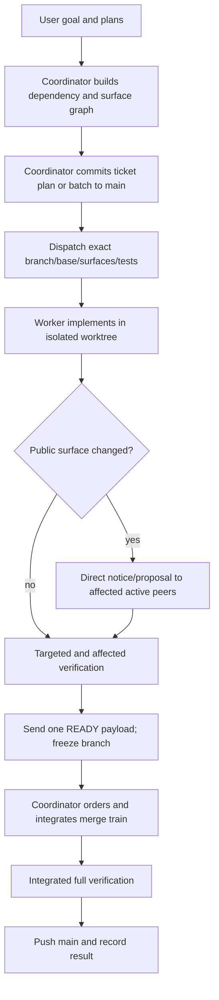

# Agent Ticket Workflow v2

This workflow keeps tickets traceable and testable while allowing multiple Codex workers to implement independent lanes concurrently.

## Core Rule

Every implementation ticket begins from a detailed ticket plan committed to `main`. Under coordinator mode, the coordinator owns or batches this start commit, then dispatches workers from the exact resulting SHA.

```text
plan on main -> exact dispatch -> isolated branch/worktree -> implement -> READY -> coordinator merge train -> result
```

## Authority and Concurrency

- Mia is the coordinator/dispatcher unless the user explicitly overrides.
- The coordinator assigns tickets, exact branch/base, scope, public surfaces, dependencies, tests, and merge order.
- One worker owns each implementation lane.
- Multiple lanes should run concurrently when their dependency and public-surface graphs permit it.
- Workers do not self-assign, switch tickets, expand scope, or mutate `main` without coordinator authority.
- Peer discussion never grants implementation authority.

## Golden Loop



## Public-Surface Rule

Workers communicate with other workers only when a public surface may move beneath another active lane or both lanes may mutate it.

Public surfaces include:

- exported headers, types, signatures, ownership rules, and invariants
- JSON/schema fields, defaults, identifiers, and validation semantics
- scenario/golden trace shape, event order, and field meaning
- CLI flags, exit codes, diagnostics, and result-file keys
- network magic/version/packet bytes and compatibility behavior
- CMake target names/link contracts/preset semantics consumed by another lane
- shared fixture formats, registries, and generated contracts

Private implementation files, local helpers, routine tests, status, and merge readiness do not justify peer messages.

Follow `agent-communication-protocol-v2.md` for change classes and message envelopes.

## Branch Naming

Use the existing ticket pattern:

```text
sprint02/sp2-###-short-slug
mitigation01/rm1-###-short-slug
```

Future work follows the same namespace/ticket/slug structure.

## Ticket Document Location

```text
docs/tickets/SP2-###-short-slug.md
```

Result document:

```text
docs/tickets/SP2-###-short-slug_result.md
```

## Coordinator-Owned Start Commit

### Normal multi-agent mode

1. Coordinator selects a maximal non-conflicting dispatch batch.
2. Coordinator prepares complete ticket documents.
3. Coordinator commits one or more ticket documents to `main`.
4. Coordinator pushes `main` once.
5. Each dispatch names the exact start SHA and feature branch.
6. Workers create their feature branches from that SHA.

Batching several ticket documents into one commit is allowed and preferred when the tickets share a baseline and are ready together. Each ticket records the same start/dispatch commit.

### Direct user override or single-agent mode

A designated worker may create the start commit only when no coordinator is active or the coordinator grants an exclusive main-mutation lease.

```powershell
git fetch --prune origin
git switch main
git pull --ff-only origin main
git status --short
git add -- docs/tickets/SP2-###-short-slug.md
git commit --no-gpg-sign -m "Start SP2-### short title"
git push origin main
git switch -c sprint02/sp2-###-short-slug
```

Do not stage unrelated user changes or ignored `assets/`.

## Dispatch Contract

A worker starts only from a coordinator `DISPATCH` or explicit user override. The dispatch must include:

- ticket and goal
- exact `origin/main`/start SHA
- exact feature branch
- assigned checkout/worktree and isolated build root
- owned files/behavior and hard non-goals
- dependency conditions
- public surfaces owned, allowed to change, and watched
- worker-side test contract
- required `READY` payload

The worker validates the contract and sends one `STARTED` message. A valid start does not need coordinator acceptance.

## Worktree and Build Isolation

Every active worker uses a separate checkout or Git worktree. Never branch-switch another worker's checkout.

Use an isolated build root. Recommended form:

```text
build/agents/<agent>/<preset-or-config>/
```

Where existing CMake presets hard-code a shared build directory, create agent-specific derived presets or pass an explicit binary directory. Shared DLL/PDB/executable locks are a configuration defect to remove, not a reason to serialize unrelated tickets.

Do not kill another agent's process unless the user explicitly directs it or the process is demonstrably orphaned.

## Worker Start

```powershell
git fetch --prune origin
git switch -c sprint02/sp2-###-short-slug <dispatch-start-sha>
git status --short --branch
```

Set upstream on first push:

```powershell
git push -u origin HEAD
```

Send:

```text
TYPE: STARTED
ticket: SP2-###
branch: sprint02/sp2-###-short-slug
base: <sha>
worktree: <path>
build-root: <path>
surfaces: owns [...]; watches [...]
status: tracked clean; unrelated assets untouched
```

Then begin. Do not wait for an ACK unless the coordinator sends a correction or hold.

## Ticket Document Template

````markdown
# SP2-###: Title

Status: planned
Owner: <agent>
Branch: sprint02/sp2-###-short-slug
Start/dispatch commit: <sha>
Source plan: docs/sprint-02-implementation-plan.md
Source design sections:
- <path and section>

## Goal

One paragraph describing the user-visible or contract-visible result.

## Non-Goals

- Explicitly excluded behavior.

## Baseline

- Relevant current behavior.
- Existing tests and limitations.

## Data Flow

```text
input owner -> parser/compiler -> runtime owner -> artifact -> oracle
```

## Ownership Boundaries

- Name the subsystem that owns truth.
- Name consumers that must not redefine it.

## Public Surfaces

Owns:
- <surface-id>

May change:
- <surface-id and allowed compatibility class>

Watches/consumes:
- <surface-id>

## Dependencies

- Hard:
- Soft/staged:

## Implementation Plan

1. Step one.
2. Step two.
3. Step three.

## Test Contract

Worker:
- Targeted:
- Affected preset:
- Contract/golden:

Coordinator integration:
- Cross-lane:
- Full preset:

## Acceptance Criteria

- Concrete pass/fail criteria.

## Risks and Watchpoints

- Determinism/API/schema/renderer/network/editor risks.

## Verification Results

Fill before `READY`.

## Public-Surface Delta

- None, or exact additive/behavioral/breaking changes and migration.

## Final Commits

Fill before `READY`.
````

Do not maintain a minute-by-minute progress log in the ticket document. Git commits and direct state events already provide progress evidence.

## Implementation Rules

- Keep gameplay correctness headless when possible.
- Renderer, editor UI, network transport, and platform input consume runtime truth; they do not own combat truth.
- Do not deepen `vulkan_scene_viewer.cpp` as a permanent engine object unless the ticket explicitly owns legacy-viewer work.
- Prefer small library targets and explicit dependencies.
- Do not introduce required PowerShell-only behavior.
- Do not stage `assets/` or unrelated untracked files unless the ticket explicitly owns them.
- Use `apply_patch` for manual edits where practical.
- Use `--no-gpg-sign` on commits.
- Commit logical behavior slices on the feature branch.

## Direct Communication During Work

Normal implementation is silent between workers.

Send a peer direct message only for an active public-surface hazard. Use:

- `SURFACE_NOTICE` for additive compatible changes; proceed immediately, no ACK.
- `SURFACE_PROPOSAL` for behavior-affecting compatible changes; continue private work and hold only publication of the contested surface.
- `SURFACE_CONFLICT` for a concrete incompatibility.
- `SURFACE_COMMIT` after pushing the relevant exact commit.

Breaking/destructive surface changes require `SCOPE_REQUEST` to the coordinator before commit.

Do not send peers status, test results, merge readiness, branch progress, parked state, or general review requests.

## Scope Changes and Blockers

Send one coordinator message with the decision needed and safe work that can continue.

```text
TYPE: BLOCKED
ticket: SP2-###
blocker: <specific dependency or semantic ambiguity>
impact: <what cannot proceed>
safe-work: <what can continue>
need: <coordinator decision/order/scope>
```

For scope expansion:

```text
TYPE: SCOPE_REQUEST
ticket: SP2-###
requested-change: <exact change>
reason: <acceptance criterion or blocker>
surface-class: private | A | B | C
affected-lanes: <names/tickets>
compatibility-plan: <adapter/migration>
```

Do not silently widen the ticket.

## Git and Remote Policy

- Work only on the assigned feature branch.
- Fetch at start, before publishing a milestone that another lane needs, and before `READY`.
- Rebase only your private feature branch and only when the coordinator requests it or before the ready candidate is frozen.
- Use `--force-with-lease` only on your own rebased feature branch.
- Never force-push `main`.
- Push durable milestones when another lane consumes them, at handoff, and at `READY`; do not push merely to create chatter.

Windows environment, when needed:

```powershell
$env:GIT_SSH_COMMAND = 'C:/Windows/System32/OpenSSH/ssh.exe'
$env:PATH = 'C:\Users\Bartek\Documents\Playground\tools\git-lfs-3.7.1\git-lfs-3.7.1;' + $env:PATH
```

Do not read password files or put secrets into commands.

## Test Selection

Workers run the narrowest meaningful tests first and the affected contract/preset before `READY`.

Suggested sequence:

```text
targeted test executable
focused CTest regex/label
affected subsystem preset
contract/golden/process smoke if touched
```

The coordinator runs the full integrated preset on the merge train. A dispatch may require a worker-side full suite for high-risk changes such as:

- scenario/golden semantic changes
- network wire/version changes
- broad public-header ownership changes
- generated schema migration
- renderer/process changes with wide integration effects

Clear `VAC_UPDATE_GOLDENS` before normal broad verification. Intentional golden changes must follow the guarded golden workflow and be listed explicitly in the result document.

## MSVC Runtime Dialogs

Before declaring a native test hung, inspect debug-runtime/assertion dialogs:

```powershell
Get-Process | Where-Object {
    $_.MainWindowTitle -match 'Debug Assertion Failed|Microsoft Visual C\+\+ Runtime Library|abort\(\)'
} | Select-Object Id,ProcessName,MainWindowTitle
```

Record any failure in the result document and make the process report to stderr/exit nonzero where practical.

## Visual Inspection

When a ticket changes UI, editor, viewer, Vulkan rendering, ImGui, map preview, visual lab, model loading, debug draw, screenshots, or layout, read `.agents/skills/visual-qa/SKILL.md`.

For `vulkan_scene_viewer`, use the capture helper when it applies:

```powershell
.\tools\capture-scene-viewer.ps1
```

For `game_editor`, build the target, launch a visible or capturable run, interact with the relevant ImGui panel, and capture the displayed state. Record the PNG/JSON artifact path. Visual evidence supplements but does not replace headless correctness or structured result evidence.

If capture is unavailable, say so explicitly and keep nonvisual build/test evidence separate from visual claims.

## READY Contract

Before `READY`:

1. Complete implementation and result documents.
2. Run worker-required tests.
3. Confirm `git status --short` has no unintended tracked changes.
4. Confirm unrelated `assets/` or user files remain untouched.
5. Fetch and reconcile only as directed; freeze an exact candidate head.
6. Push the exact candidate.
7. Send one `READY` message.

```text
TYPE: READY
ticket: SP2-###
head: <sha>
base: <dispatch sha or current merge base>
scope: <concise file/behavior summary>
surfaces: <exact delta and compatibility class>
tests: <targeted and affected results>
status: tracked clean; unrelated user state untouched
risks: <residual risks>
```

Do not separately post the same payload to an inbox, status log, claim, decisions log, and merge log. The coordinator validates Git and records the eventual merge result.

After `READY`, do not mutate the branch unless the coordinator sends `REPAIR`.

## Merge Policy

The coordinator is the default merge driver and owns merge order.

Workers do not switch to `main` or merge their own branch unless given an exact `MERGE_LEASE`. A lease ends on publication, failure, base movement, or scope/head change.

The coordinator may merge several disjoint ready branches into one train, run integrated verification once, and push `main` once.

## Result Document Contract

The result document records:

- exact start, implementation, and final candidate commits
- behavior changed
- public-surface delta and compatibility/migration
- worker test evidence
- intentional golden drift or explicit none
- local asset/untracked state
- residual risks and deferred work

Do not duplicate coordinator state or minute-by-minute progress.

## Handoff

A handoff is coordinator-authorized. Provide:

- exact branch/head/base
- completed behavior
- remaining acceptance criteria
- tests passed/failed/not run
- public-surface messages/decisions
- relevant files and artifacts
- user changes deliberately untouched

Push the handoff commit, send one coordinator message, and stop editing.

## When to Ask the User

Ask before:

- deleting or moving user-created assets
- committing large untracked content the ticket did not create
- changing sprint/product scope
- choosing between incompatible product semantics
- adding heavy dependencies not accepted by design
- breaking a durable public contract when no compatible migration is available

Do not ask for routine implementation choices that the ticket and codebase determine conservatively.

## Definition of Done

A ticket is done when:

- the start plan exists on `main`
- implementation meets acceptance criteria
- public-surface changes are explicit and coordinated
- required worker and integrated tests pass
- regression coverage exists
- result documentation is complete
- the coordinator publishes the branch to `main`
- unrelated user changes remain untouched

If the ticket cannot meet these conditions, send `BLOCKED` or `FAILED`; do not widen scope or generate repeated status chatter.
