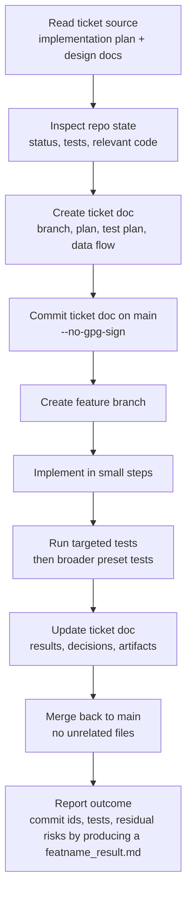

# Agent Ticket Workflow

This workflow is for Codex and other agents working on this project. It is designed to keep long engine/editor tasks traceable, testable, and easy to resume.

The core rule from the user:

```text
When starting a task/ticket from the implementation plan, make a commit on main at the start with the detailed plan, test plan, data flow, and feature branch name. Then branch out and attack the ticket.
```

## Golden Loop



## Branch Naming

Use:

```text
sprint01/sp1-###-short-slug
```

Examples:

```text
sprint01/sp1-001-cmake-ctest-spine
sprint01/sp1-006-move-schema-compiler
sprint01/sp1-010-scenario-runner-goldens
```

Future sprints should use the same pattern:

```text
sprint02/sp2-###-short-slug
```

## Ticket Document Location

Create one ticket document per ticket:

```text
docs/tickets/SP1-###-short-slug.md
```

If `docs/tickets` does not exist, create it in the start commit.

## Start Commit Requirements

Before implementation begins:

1. Be on `main`.
2. Inspect tracked and untracked status.
3. Do not stage unrelated user changes.
4. Create the ticket document.
5. Commit the ticket document to `main`.
6. Create the feature branch from that commit.

Commands:

```powershell
git switch main
git status --short
git add -- docs/tickets/SP1-###-short-slug.md
git commit --no-gpg-sign -m "Start SP1-### short title"
git switch -c sprint01/sp1-###-short-slug
```

The start commit is not busywork. It pins the intended scope before implementation pressure starts bending the work.

## Ticket Document Template

````markdown
# SP1-###: Title

Status: planned
Branch: sprint01/sp1-###-short-slug
Start commit: <hash after commit>
Source plan: docs/sprint-01-implementation-plan.md
Source design sections:
- docs/action_combat_engine_editor_design.md section X

## Goal

One paragraph describing the user-visible outcome and why this ticket exists.

## Non-Goals

- Explicitly out of scope.
- Things that are tempting but should not happen in this ticket.

## Current Baseline

- Relevant files and current behavior.
- Known tests that cover nearby behavior.
- Existing limitations.

## Data Flow

```text
input -> transform -> output -> tests/artifacts
```

Include important ownership boundaries. Example:

```text
Move JSON -> validator -> compiled move table -> combat tick -> event trace -> golden comparison
```

## Implementation Plan

1. Step one.
2. Step two.
3. Step three.

## Test Plan

- Unit:
- Integration:
- Process/CTest:
- Manual/visual if needed:

## Acceptance Criteria

- Concrete pass/fail bullets.

## Risks and Watchpoints

- Determinism risks.
- API ownership risks.
- Renderer/network/editor coupling risks.

## Progress Log

- YYYY-MM-DD: Started.

## Verification Results

Fill this before merging.

## Final Commits

Fill this after implementation.
````

## Implementation Rules

- Keep gameplay correctness headless when possible.
- Renderer, editor UI, networking transport, and platform input are consumers of runtime state, not owners of combat truth.
- No ticket should deepen `vulkan_scene_viewer.cpp` as a permanent engine object unless the ticket is explicitly preserving the legacy viewer.
- Prefer small library targets and explicit dependencies.
- Do not introduce required PowerShell-only behavior.
- Do not stage `assets/` or other unrelated untracked files unless the ticket explicitly owns them.
- Use `apply_patch` for manual edits.
- Use `--no-gpg-sign` on commits.

## Remote Push Policy

Agents should push durable milestones to GitHub so parallel work and handoffs do not depend on one local checkout.

Use the canonical repository URL:

```text
git@github.com:walkingIssue/vulkan-action-client.git
```

Push at these points:

- After the start commit is created and the feature branch is created.
- After any significant chunk of code changes, especially a logical slice that passes targeted tests.
- After updating verification/result documents near the end of a ticket.
- After merging a feature branch back to `main`.

If no `origin` remote is configured, push directly to the canonical URL:

```powershell
git push git@github.com:walkingIssue/vulkan-action-client.git HEAD:refs/heads/sprint01/sp1-###-short-slug
git push git@github.com:walkingIssue/vulkan-action-client.git main:refs/heads/main
```

On this Windows machine, GitHub SSH may need Windows OpenSSH and local Git LFS on `PATH`:

```powershell
$env:GIT_SSH_COMMAND = 'C:/Windows/System32/OpenSSH/ssh.exe'
$env:PATH = 'C:\Users\Bartek\Documents\Playground\tools\git-lfs-3.7.1\git-lfs-3.7.1;' + $env:PATH
```

Do not read password files or copy secrets into commands unless the user explicitly confirms there is no key-based path. Prefer the configured SSH key and `--no-gpg-sign`.

## Multi-Agent Local Coordination

Multiple agents may be running on the same machine from sibling copies of this repository. Assume other agents may build, test, or push nearby branches at the same time.

- Work in the checkout assigned to you and avoid touching sibling worktrees unless the user asks.
- Expect occasional fights over build outputs, locked executables, PDBs, DLLs, or test artifacts.
- If a build or copy fails because a file is locked, wait briefly, inspect the owning process when useful, and retry before declaring the failure mysterious.
- Do not kill another agent's process unless the user explicitly asks or it is clearly orphaned and blocking the requested work.
- Pull or inspect remote refs before major merges when another agent may have pushed.
- Patience is key; a transient Windows file lock is usually coordination noise, not a design signal.

## Local Agent Comms Protocol

Use the untracked machine-local coordination board when multiple agents are active:

```text
C:\Users\Bartek\Documents\Playground\vulkan-agent-comms
```

The directory is intentionally outside this repository so Git operations do not stage, reset, or branch-switch it away.

Expected files:

```text
status/agent-a.md
status/agent-b.md
claims/README.md
inbox/agent-a.md
inbox/agent-b.md
decisions.md
merge-log.md
```

Coordination rules:

- At start of work, append branch, checkout path, current task, and likely touched files to your `status/<agent>.md`.
- Before editing high-conflict files, append a claim with intent, files, response deadline, and default action.
- Use a 4-minute response window for routine claims. If no response appears, proceed conservatively with the smallest useful change.
- For direct requests, append to the other agent's inbox and include the same response deadline and default action.
- Record durable cross-ticket decisions in `decisions.md`.
- Before push or merge, append branch, commit, tests, and watchouts to `merge-log.md`.
- Keep all notes append-only. Do not rewrite another agent's notes except to add a clearly marked response.

High-conflict files include `CMakeLists.txt`, `CMakePresets.json`, shared public headers, checked-in fixtures used by multiple tickets, `src/vulkan_scene_viewer.cpp`, and any running build/test outputs such as DLLs, PDBs, or executables.

## Test Selection

Each ticket should run the narrowest meaningful suite first, then a broader suite before merge.

Suggested order:

```text
targeted unit test executable
targeted CTest label
full debug CTest preset
viewer or process smoke if touched
```

Examples:

```powershell
ctest --preset msvc-debug-unit
ctest --preset msvc-debug-integration
ctest --preset msvc-debug
```

Until presets exist, use the current repo scripts as a bridge, but ticket acceptance should move toward CMake/CTest.

## MSVC Runtime Dialogs

On Windows, MSVC debug-runtime failures can appear as desktop dialogs while the shell only shows a timeout, abort, or empty output. Agents must treat this as an inspectable failure mode, not as a mysterious hung test.

Before declaring a native test hung, check for visible runtime/assertion windows:

```powershell
Get-Process | Where-Object {
    $_.MainWindowTitle -match 'Debug Assertion Failed|Microsoft Visual C\+\+ Runtime Library|abort\(\)'
} | Select-Object Id,ProcessName,MainWindowTitle
```

If such a window exists:

- Record the process name and window title in the ticket/result notes.
- Prefer fixing the test or executable so failures print to stderr and exit nonzero.
- For test binaries that intentionally exercise failure paths, suppress MSVC report dialogs inside the test harness and route assertions to terminal output.
- Do not keep waiting on the process without inspecting the dialog state.

A future local Codex plugin may wrap this check, but the repository workflow should not depend on the plugin. CTest/result files remain the durable automation path.

## Data Flow Requirement

Every ticket must include a data flow section because this project is easy to accidentally couple:

- Input ownership: file, device, network, or test fixture.
- Transform/compile step: parser, validator, runtime compiler, tick runner, renderer adapter.
- Runtime owner: AuthoringScene, RuntimeWorld, CombatCore, AnimationCore, Renderer, Network.
- Output artifact: event trace, state hash, result file, rendered frame, packet.
- Test oracle: field compare, golden trace, state hash, validation result, visual smoke.

If the data flow cannot be described simply, the ticket is probably too large.

## Commit and Merge Policy

During implementation, commit logical slices on the feature branch.

Commit messages should name behavior:

```text
Add move tick range validation
Add combat scenario result files
Render proxy hitbox debug lines
```

Before merging:

1. Update the ticket document with verification results.
2. Run required tests.
3. Ensure `git status --short` only shows intended changes.
4. Merge back to main.

Preferred merge when the branch is ready:

```powershell
git switch main
git merge --no-gpg-sign --no-ff sprint01/sp1-###-short-slug
```

If the project later prefers fast-forward-only history, update this workflow. Until then, a merge commit keeps ticket boundaries visible.

## Handoff Summary

When stopping or handing off, leave enough context for another agent:

- Current branch.
- Last commit.
- What changed.
- What tests passed.
- What tests failed or were not run.
- Open design decisions.
- Files most relevant to continue.
- Any user changes deliberately left untouched.

## When to Ask the User

Ask before:

- Deleting or moving user-created assets.
- Committing large untracked content that the ticket did not create.
- Changing the sprint scope.
- Choosing between incompatible product semantics, such as cancel rules or combat priority policy.
- Adding heavy dependencies not already accepted by the design.

Do not ask for routine implementation details when the ticket and codebase make a conservative choice clear.

## Definition of Done for an Agent Ticket

A ticket is done when:

- The ticket document exists and has verification results.
- The implementation matches the ticket acceptance criteria.
- Required tests pass through the best available CMake/CTest path.
- New behavior has regression coverage.
- The final response reports commits, tests, artifacts, and residual risk.
- Unrelated user changes are untouched.

If a ticket cannot meet these criteria, mark the ticket document with the blocker and stop before widening scope silently.
