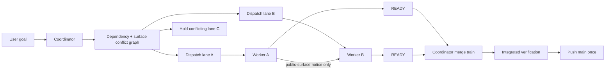

# Multi-Agent Workflow Audit and Redesign

## Executive Finding

The current workflow is safe but over-serialized. It uses append-only Markdown files as both transport and audit storage, requires acknowledgements for routine state, and asks the coordinator to approve several intermediate steps that do not change project risk. The result is a queue in which implementation is often single-threaded even when tickets are technically independent.

The revised model separates three concerns:

1. **Codex direct messages are the low-latency transport.**
2. **The coordinator owns assignment, dependency resolution, public-surface arbitration, and merge order.**
3. **Files retain only recoverable current state and durable decisions; they are not a polling channel.**

The key concurrency rule is:

> Dispatch as many independent lanes as the dependency graph and public-surface conflict graph allow. Serialize only public-surface mutations that can invalidate another active lane, and serialize publication to `main`.

## Evidence From the Supplied Run

The supplied coordination artifacts contain 5,387 lines across the coordinator ledger, one inbox, two status files, the merge log, and decisions log. Simple text-signal counts show the shape of the overhead:

| Signal | Text occurrences | Interpretation |
| --- | ---: | --- |
| `ACK` | 729 | Routine status and dispatch acknowledgement dominates communication. |
| `parked` | 164 | Idle-state repetition is recorded many times without changing work. |
| `read-only` | 72 | Agents repeatedly restate that they are not acting. |
| `No repo edits` | 35 | Negative work reports consume state/log space. |
| `heartbeat` | 15 | The coordinator polls and records unchanged state. |
| `merge request` | 100 | Readiness and merge state are duplicated across several files. |

These are text occurrences rather than unique events, but they demonstrate substantial duplication.

A single SP2-003 lane generated coordinator entries for dispatch, start acceptance, start-document baseline acceptance, progress gate, verification observation, merge approval, merge-in-progress, and closeout. SP2-004 repeated the same pattern and then stalled at the merge gate despite being ready. The worker implementation slice was shorter than the surrounding control-plane sequence.

## Failure Points

### 1. The board is a synchronous message bus

Agents write inbox or claim files, wait for other agents to poll them, append responses, and then poll again. A file write is durable but it is not immediate delivery. The four-minute response window converts ordinary coordination into forced idle time.

**Change:** Use Codex direct-agent messages for delivery. The board becomes recovery state and audit evidence only.

### 2. All-agent acknowledgement storms

Clean-kickoff snapshots and current-status entries frequently require acknowledgements from every agent. This is an all-to-all protocol: with `n` agents, routine coordination trends toward `O(n^2)` messages even though only the coordinator needs the state.

**Change:** A worker reports state once to the coordinator. Peers do not acknowledge status. A direct-message notice requires no reply unless the recipient has a conflict.

### 3. Coordinator approval is too granular

The coordinator separately accepts dispatch, worker start state, start-document publication, progress, verification, merge request, merge-in-progress, and closeout. Most of these checks repeat evidence already encoded in Git or the ticket result.

**Change:** Reduce the normal lifecycle to four worker events:

```text
STARTED -> optional BLOCKED/SCOPE_REQUEST -> READY -> MERGED/CLOSED
```

The coordinator does not acknowledge a valid `STARTED`; silence means the dispatch stands. It responds only when correcting, holding, or changing the assignment.

### 4. "One owner per lane" became "one active lane total"

The ledger repeatedly parks all agents while one implementation lane is open. This prevents duplicate work, but it also prevents independent work.

**Change:** Keep one owner per lane, but dispatch the maximal non-conflicting set of lanes. Build a dependency DAG and a public-surface conflict graph. Only connected/conflicting lanes are serialized.

### 5. Static hot-file lists over-serialize unrelated work

Treating every touch to `CMakeLists.txt`, a public header, a viewer file, or fixtures as a global lock is conservative but imprecise. Two additive CMake changes may merge cleanly; a private `.cpp` change may be riskier if it alters a shared runtime contract.

**Change:** Coordinate semantic **public surfaces**, not filenames alone. The dispatch records surfaces owned, surfaces that may change, and surfaces watched by other active lanes.

### 6. Ticket start commits create repeated `main` churn

Each worker commits a ticket document directly to `main`, pushes it, then branches. Every new ticket invalidates other agents' baseline snapshots and causes fetch/rebase/status cycles.

**Change:** Preserve the user's start-commit rule, but make the coordinator own it. The coordinator may batch several complete ticket documents into one dispatch commit on `main`; workers branch from that exact commit. Workers do not mutate `main` for normal starts.

### 7. Append-only current state creates context pollution

Status and coordinator files grow continuously and retain stale snapshots next to current ones. Every recovery requires rereading and reconciling history.

**Change:** Current state is mutable and compact. Only `decisions.md` and `merge-log.md` remain append-only. Historical status is archived outside the critical read path.

### 8. Repeated remote polling substitutes for events

The coordinator repeatedly checks whether a branch advanced, whether an ACK appeared, and whether `main` moved. Workers also poll for approval. This consumes turns without progressing work.

**Change:** Event-driven coordination. Workers send `STARTED`, `BLOCKED`, `SURFACE_*`, and `READY`. The coordinator fetches Git when handling a relevant event, not on a heartbeat cadence.

### 9. Shared checkout and build outputs create artificial serialization

Several entries observe or avoid the same checkout and report Windows executable/PDB locks. Waiting and retrying treats a preventable isolation problem as normal coordination.

**Change:** One checkout/worktree and one build tree per active worker. Suggested build root:

```text
build/agents/<agent>/<preset-or-config>/
```

A worker never switches another worker's checkout and never uses another worker's build directory.

### 10. Test work is duplicated at every gate

Workers run targeted suites, full suites, and then the same full suite again after merge. This is safe but expensive.

**Change:** Workers run targeted and affected presets. The coordinator runs the full integration suite on the ordered merge train. A high-risk public-surface mutation may still require a full worker-side suite, but that is a dispatch condition rather than a universal default.

### 11. Authority and transport are mixed

Peer messages, claims, remote branches, coordinator notes, and user instructions can all appear to authorize work. The current documents then need repeated statements that old claims are historical.

**Change:** Authority is explicit:

- User instruction may override anything.
- Coordinator `DISPATCH` or `SCOPE_UPDATE` authorizes implementation.
- Peer messages never authorize new work or scope.
- Git and board records are evidence, not authority.

### 12. Silence has unsafe semantics for breaking changes

The current default says to proceed conservatively after silence. That works for an additive helper but is unsafe for a schema rename, protocol version change, or trace semantic change.

**Change:** Classify public-surface changes:

- **Additive:** notify and proceed; no ACK.
- **Behavioral-compatible:** notify affected workers; continue private work, but do not publish the surface change until conflict is resolved.
- **Breaking/destructive:** coordinator approval required before the public mutation is committed.

## Revised Operating Model



## State and File Model

| Artifact | Owner | Mutation model | Purpose |
| --- | --- | --- | --- |
| `coordinator.md` | Coordinator | Replace current snapshot | Authoritative active assignments, conflicts, merge queue. |
| `status/<agent>.md` | That agent | Replace current snapshot | Recovery-only state; maximum one current record. |
| `dispatch/<ticket>.md` | Coordinator | Immutable after dispatch; supersede explicitly | Exact assignment contract and start SHA. |
| `decisions.md` | Coordinator or designated recorder | Append-only | Durable cross-ticket architecture/process decisions. |
| `merge-log.md` | Coordinator/merge driver | Append-only | One entry per integrated result or failed merge train. |
| `inbox/*` | Any agent | Fallback only | Used only when Codex direct messaging is unavailable. |
| direct messages | Runtime | Ephemeral transport | Dispatch events, blockers, surface notices, readiness. |

## Recommended Lifecycle

### Coordinator

1. Reconcile user goal, current `main`, active lanes, and unprocessed direct messages.
2. Build the ticket dependency DAG and active public-surface conflict graph.
3. Prepare one start/dispatch commit on `main`, batching independent ticket documents when practical.
4. Dispatch the maximal non-conflicting set with exact base SHA, branch, scope, surfaces, and tests.
5. Handle only state-changing events; do not heartbeat unchanged state.
6. Queue `READY` branches, choose merge order, and integrate them in a clean merge workspace.
7. Run integrated tests once per merge train or at public-surface risk boundaries.
8. Push `main` once and send closeout plus newly unblocked dispatches.

### Worker

1. Receive `DISPATCH` and validate the exact base/branch/worktree.
2. Send one `STARTED` message; begin immediately unless the dispatch is invalid.
3. Work privately without peer chatter.
4. Message peers only when changing a public surface they actively consume or may concurrently change.
5. Send `BLOCKED` or `SCOPE_REQUEST` only when the coordinator must act.
6. Send one `READY` payload with commit, diff scope, tests, public-surface deltas, and risks.
7. Stop mutating the branch unless the coordinator requests a repair.

## Expected Effects

- Independent implementation becomes parallel rather than coordinator-serialized.
- Normal worker-to-worker chatter approaches zero.
- Acknowledgements become exception responses rather than mandatory handshakes.
- The coordinator reads a small current-state snapshot instead of thousands of historical lines.
- Public API/schema changes are safer because they use explicit compatibility classes.
- `main` remains serialized and auditable.
- Start-plan traceability is retained through coordinator-owned start commits.
- Windows lock contention falls through isolated worktrees and build directories.

## Migration Plan

1. Add the revised workflow, coordinator loop, and communication protocol.
2. Archive the current `status/`, `inbox/`, and coordinator logs under a dated `archive/` directory.
3. Replace each status file with a single current snapshot.
4. Deprecate file inboxes for routine traffic; retain them as a fallback.
5. Have the coordinator define surface ownership and watchers in the next dispatch.
6. Move ticket start commits to the coordinator and batch them when multiple lanes are ready.
7. Give each worker a unique checkout/worktree and build root.
8. Pilot with two disjoint lanes and one deliberately shared public surface.
9. Measure: active implementation concurrency, direct messages per ticket, time from dispatch to start, time waiting at merge gate, and number of full-suite runs.
10. Remove old ACK/heartbeat rules after the pilot succeeds.

## Success Criteria

- At least two disjoint tickets can be active concurrently.
- A normal ticket requires no peer message.
- A public-surface ticket uses at most one proposal/notice and one committed-delta message per affected peer.
- Dispatch-to-start requires one worker response and no coordinator acceptance round-trip.
- No periodic parked/read-only/heartbeat entries are written.
- One authoritative current-state table identifies every lane and merge order.
- Only the coordinator or an explicitly leased merge driver mutates `main`.
