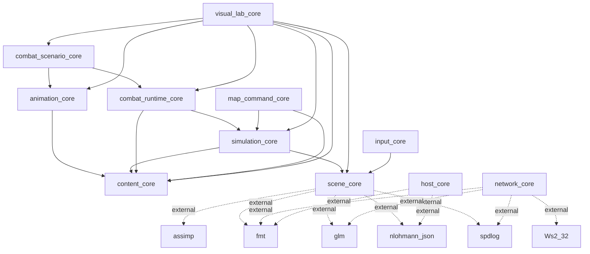
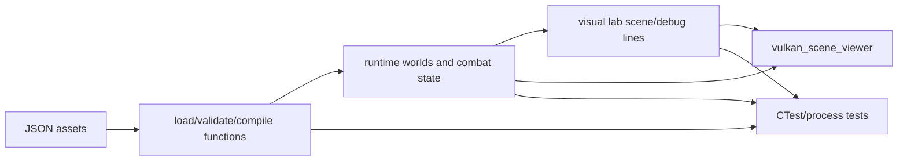
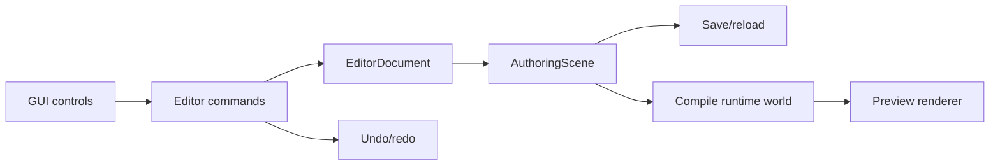

# Main Project Dependency Graph

Scope: current main project API and executable structure, excluding the new `src/game_editor.cpp` ImGui bootstrap shell.

This document describes what is actually implemented today. It is intentionally not a wish-list graph from the larger editor design doc.

## High-Level Finding

The repo is mostly a set of data formats, compilers, runtime simulations, visual-lab builders, process runners, and one closed Vulkan viewer executable.

There is no implemented editable editor document model yet. In particular, the current codebase does not expose:

- `EditorDocument`
- selection state
- hierarchy/inspector mutation commands
- undo/redo command stack
- asset browser ownership
- viewport object picking/edit handles
- GUI save/apply commands

The implemented authoring path is JSON plus scripted commands. The implemented visual path is a viewer/visual lab. That is why the current editor-like window can show data but cannot really edit data end to end.

## CMake Target Graph

## Executable Graph

The CMake file also defines `game_editor`, but this graph omits it by scope.

```mermaid
graph TD
  scene_probe --> scene_core
  scene_probe --> host_core

  asset_fixture_check --> host_core

  map_command_runner --> map_command_core
  map_command_runner --> host_core

  udp_state_server --> network_core

  combat_scenario_runner --> combat_scenario_core
  combat_scenario_runner --> host_core

  vulkan_scene_viewer --> scene_core
  vulkan_scene_viewer --> host_core
  vulkan_scene_viewer --> input_core
  vulkan_scene_viewer --> network_core
  vulkan_scene_viewer --> visual_lab_core
  vulkan_scene_viewer -. external .-> Vulkan
  vulkan_scene_viewer -. external .-> GLFW
  vulkan_scene_viewer -. external .-> fmt
  vulkan_scene_viewer -. external .-> glm
  vulkan_scene_viewer -. external .-> spdlog

  toolchain_probe -. external .-> Vulkan
  toolchain_probe -. external .-> VMA
  toolchain_probe -. external .-> Jolt
  toolchain_probe -. external .-> assimp
  toolchain_probe -. external .-> fmt
  toolchain_probe -. external .-> GLFW
  toolchain_probe -. external .-> glm
  toolchain_probe -. external .-> imgui
  toolchain_probe -. external .-> nlohmann_json
  toolchain_probe -. external .-> spdlog
```

## Header-Level Project Dependencies

```mermaid
graph TD
  authoring_scene_h["content/authoring_scene.hpp"]
  move_asset_h["content/move_asset.hpp"]
  proxy_animation_h["animation/proxy_animation.hpp"]
  scene_runtime_h["scene/scene_runtime.hpp"]
  scene_geometry_h["render/scene_geometry.hpp"]
  combat_simulation_h["combat/combat_simulation.hpp"]
  simulation_runtime_world_h["simulation/runtime_world.hpp"]
  combat_collision_h["combat/combat_collision.hpp"]
  combat_runtime_h["combat/combat_runtime.hpp"]
  combat_scenario_h["combat/combat_scenario.hpp"]
  visual_lab_h["visual_lab/visual_lab.hpp"]
  map_command_script_h["authoring/map_command_script.hpp"]
  control_profile_h["config/control_profile.hpp"]
  glfw_bindings_h["input/glfw_control_bindings.hpp"]
  state_protocol_h["network/state_protocol.hpp"]
  udp_socket_h["network/udp_socket.hpp"]
  snapshot_client_h["network/snapshot_client.hpp"]
  snapshot_relay_h["network/snapshot_relay.hpp"]
  host_cli_h["host/host_cli.hpp"]

  move_asset_h --> authoring_scene_h
  proxy_animation_h --> authoring_scene_h
  scene_geometry_h --> scene_runtime_h
  combat_simulation_h --> scene_runtime_h
  simulation_runtime_world_h --> combat_simulation_h
  simulation_runtime_world_h --> authoring_scene_h
  combat_collision_h --> move_asset_h
  combat_runtime_h --> move_asset_h
  combat_runtime_h --> simulation_runtime_world_h
  combat_scenario_h --> combat_collision_h
  combat_scenario_h --> simulation_runtime_world_h
  visual_lab_h --> combat_scenario_h
  visual_lab_h --> authoring_scene_h
  visual_lab_h --> scene_geometry_h
  visual_lab_h --> scene_runtime_h
  visual_lab_h --> simulation_runtime_world_h
  map_command_script_h --> authoring_scene_h
  control_profile_h --> combat_simulation_h
  glfw_bindings_h --> control_profile_h
  snapshot_client_h --> state_protocol_h
  snapshot_client_h --> udp_socket_h
  snapshot_relay_h --> state_protocol_h
```

## Public API Inventory

Notes:

- C++ `struct` members are public by default. Most project structs are plain data containers with no member functions.
- Free functions are listed because most project behavior is exposed as free functions rather than class methods.
- Implementation-only types in `.cpp` files are listed separately near the bottom.

### `content_core`

Headers: `src/content/authoring_scene.hpp`, `src/content/move_asset.hpp`

Depends on: `glm`, `nlohmann_json`.

#### `vac::content` Types

| Type | Kind | Project Dependencies | Public Member Functions |
| --- | --- | --- | --- |
| `AuthoredObjectId` | struct | none | none |
| `RuntimeEntityId` | struct | none | none |
| `PrimitiveKind` | enum class | none | none |
| `ColliderKind` | enum class | none | none |
| `AuthoringTransform` | struct | none | none |
| `PrimitiveShape` | struct | `PrimitiveKind` | none |
| `MaterialOverride` | struct | none | none |
| `Collider` | struct | `ColliderKind` | none |
| `AuthoringObject` | struct | `AuthoredObjectId`, `AuthoringTransform`, `PrimitiveShape`, `MaterialOverride`, `Collider` | none |
| `SpawnPoint` | struct | none | none |
| `WorldBounds` | struct | none | none |
| `AuthoringScene` | struct | `WorldBounds`, `AuthoringObject`, `SpawnPoint` | none |
| `ContentDiagnostic` | struct | none | none |
| `ValidationResult` | struct | `ContentDiagnostic` | `ok` |
| `Bounds3` | struct | none | none |
| `RuntimeEntity` | struct | `RuntimeEntityId`, `AuthoredObjectId`, `AuthoringTransform`, `PrimitiveKind`, `Bounds3` | none |
| `RuntimeCollider` | struct | `RuntimeEntityId`, `ColliderKind`, `Bounds3` | none |
| `RuntimeSpawnPoint` | struct | none | none |
| `RuntimeWorld` | struct | `WorldBounds`, `RuntimeEntity`, `RuntimeCollider`, `RuntimeSpawnPoint` | none |
| `CompileResult` | struct | `ValidationResult`, `RuntimeWorld` | `ok` |
| `TickRange` | struct | none | none |
| `InputTrigger` | struct | none | none |
| `MovePhase` | struct | `TickRange` | none |
| `MovementTrack` | struct | `TickRange` | none |
| `HitboxTrack` | struct | `TickRange` | none |
| `HurtboxOverride` | struct | `TickRange` | none |
| `CancelWindow` | struct | `TickRange` | none |
| `MoveEvent` | struct | none | none |
| `MoveResources` | struct | none | none |
| `MoveAsset` | struct | `InputTrigger`, `MovePhase`, `MovementTrack`, `HitboxTrack`, `HurtboxOverride`, `CancelWindow`, `MoveResources`, `MoveEvent` | none |
| `InternTable` | struct | none | none |
| `CompiledRange` | struct | none | none |
| `CompiledPhase` | struct | `CompiledRange` | none |
| `CompiledMovementTrack` | struct | `CompiledRange` | none |
| `CompiledHitboxTrack` | struct | `CompiledRange` | none |
| `CompiledHurtboxOverride` | struct | `CompiledRange` | none |
| `CompiledCancelWindow` | struct | `CompiledRange` | none |
| `CompiledMoveEvent` | struct | none | none |
| `CompiledMove` | struct | `InputTrigger`, `MoveResources`, `InternTable`, compiled move structs | none |
| `MoveCompileResult` | struct | `ValidationResult`, `CompiledMove` | `ok` |

#### `vac::content` Free Functions

- `authoringSceneFromJson`
- `loadAuthoringScene`
- `toCanonicalJson(AuthoringScene)`
- `toCanonicalJsonString(AuthoringScene)`
- `saveAuthoringScene`
- `validateAuthoringScene`
- `compileRuntimeWorld`
- `toString(PrimitiveKind)`
- `toString(ColliderKind)`
- `moveAssetFromJson`
- `loadMoveAsset`
- `toCanonicalJson(MoveAsset)`
- `toCanonicalJsonString(MoveAsset)`
- `validateMoveAsset`
- `compileMoveAsset`

### `animation_core`

Header: `src/animation/proxy_animation.hpp`

Depends on: `content_core`, `glm`, `nlohmann_json`.

#### `vac::animation` Types

| Type | Kind | Project Dependencies | Public Member Functions |
| --- | --- | --- | --- |
| `RootKeyframe` | struct | none | none |
| `SocketKeyframe` | struct | none | none |
| `ProxySocketTrack` | struct | `SocketKeyframe` | none |
| `ProxyAnimationAsset` | struct | `RootKeyframe`, `ProxySocketTrack` | none |
| `SocketPose` | struct | none | none |
| `ProxyPose` | struct | `SocketPose` | none |

#### `vac::animation` Free Functions

- `proxyAnimationFromJson`
- `loadProxyAnimation`
- `toCanonicalJson`
- `toCanonicalJsonString`
- `validateProxyAnimation`
- `sampleProxyPose`
- `sampleProxyPoseAtTick`
- `rootMotionDelta`
- `findSocket`

### `scene_core`

Headers: `src/scene/scene_runtime.hpp`, `src/render/scene_geometry.hpp`, `src/config/control_profile.hpp`, `src/combat/combat_simulation.hpp`

Depends on: `assimp`, `fmt`, `glm`, `nlohmann_json`, `spdlog`.

This target is currently mixed: it contains scene loading/render geometry, control profile loading, and combat movement helpers.

#### `vac` Scene/Render Types

| Type | Kind | Project Dependencies | Public Member Functions |
| --- | --- | --- | --- |
| `Bounds` | struct | none | none |
| `Transform` | struct | none | none |
| `ModelStats` | struct | `Bounds` | none |
| `SceneInstance` | struct | `Transform`, `Bounds` | none |
| `ProceduralInstance` | struct | `Transform`, `Bounds` | none |
| `SceneRuntime` | struct | `ModelStats`, `SceneInstance`, `ProceduralInstance`, `Bounds` | none |
| `SceneVertex` | struct | none | none |
| `SceneDrawData` | struct | `SceneVertex` | none |
| `SceneRenderData` | struct | `SceneVertex` | none |
| `ControlBindings` | struct | none | none |
| `ControlProfile` | struct | `combat::MovementTuning`, `ControlBindings` | none |

#### `vac::combat` Movement Types

| Type | Kind | Project Dependencies | Public Member Functions |
| --- | --- | --- | --- |
| `MovementTuning` | struct | none | none |
| `LocalMoveIntent` | struct | none | none |
| `ControlFrame` | struct | none | none |
| `ArenaLimits` | struct | none | none |
| `ActorState` | struct | `vac::Transform` | none |

#### `vac` and `vac::combat` Free Functions

- `defaultProjectRoot`
- `loadScene`
- `transformBounds`
- `refreshSceneBounds`
- `formatBounds`
- `makeTransformMatrix`
- `instanceColor`
- `buildSceneRenderData`
- `buildSceneLineData`
- `defaultControlProfilePath`
- `loadControlProfile`
- `combat::beginTick`
- `combat::applyCharacterLocomotion`
- `combat::applyFramedStrafeLocomotion`
- `combat::applyMoveToWorldTarget`
- `combat::interpolate`

### `simulation_core`

Header: `src/simulation/runtime_world.hpp`

Depends on: `content_core`, `scene_core`.

#### `vac::simulation` Types

| Type | Kind | Project Dependencies | Public Member Functions |
| --- | --- | --- | --- |
| `RuntimeActorId` | struct | none | none |
| `InputFrame` | struct | `RuntimeActorId` | none |
| `RuntimeActor` | struct | `RuntimeActorId`, `combat::ActorState` | none |
| `RuntimeWorld` | struct | `content::WorldBounds`, `combat::ArenaLimits`, `combat::MovementTuning`, `RuntimeActor` | none |
| `TickResult` | struct | none | none |

#### `vac::simulation` Free Functions

- `importRuntimeWorld`
- `findActor(RuntimeWorld &, RuntimeActorId)`
- `findActor(const RuntimeWorld &, RuntimeActorId)`
- `actorIdForSpawn`
- `advanceFixedTick`
- `runFixedTicks`
- `runWithRenderCadence`
- `stateHash`
- `presentationTransform`

### `combat_runtime_core`

Headers: `src/combat/combat_collision.hpp`, `src/combat/combat_runtime.hpp`

Depends on: `content_core`, `simulation_core`.

#### `vac::combat` Collision Types

| Type | Kind | Project Dependencies | Public Member Functions |
| --- | --- | --- | --- |
| `CombatVolumeKind` | enum class | none | none |
| `VolumeBinding` | struct | none | none |
| `CombatVolume` | struct | `CombatVolumeKind`, `VolumeBinding` | none |
| `SocketTransform` | struct | none | none |
| `ResolvedVolume` | struct | `CombatVolumeKind` | none |
| `HurtVolume` | struct | `ResolvedVolume` | none |
| `CombatHitCandidate` | struct | none | none |
| `CombatHitQuery` | struct | `content::CompiledRange`, `ResolvedVolume`, `HurtVolume` | none |

#### `vac::combat` Runtime Types

| Type | Kind | Project Dependencies | Public Member Functions |
| --- | --- | --- | --- |
| `CombatEventKind` | enum class | none | none |
| `CancelSignal` | enum class | none | none |
| `CombatEvent` | struct | `simulation::RuntimeActorId`, `CombatEventKind` | none |
| `BufferedCommand` | struct | none | none |
| `CombatActorState` | struct | `simulation::RuntimeActorId`, `BufferedCommand` | none |
| `RuntimeMove` | struct | `content::CompiledMove` | none |
| `CombatMoveLibrary` | class | `content::CompiledMove`, `RuntimeMove` | `CombatMoveLibrary`, `findMove`, `findByLogicalId`, `findByCommand`, `runtimeIdForLogicalId`, `runtimeDestinationId`, `size` |
| `CombatRuntime` | struct | `CombatMoveLibrary`, `CombatActorState` | none |
| `CombatTickContext` | struct | `simulation::RuntimeActorId`, `CancelSignal` | none |
| `CombatTickResult` | struct | `CombatEvent` | none |
| `CombatHitEffectResult` | struct | none | none |

#### `vac::combat` Free Functions

- `isActiveOnTick`
- `resolveVolume`
- `overlaps`
- `sweptIntersects`
- `collectHitCandidates`
- `filterOncePerTarget`
- `createCombatRuntime`
- `findCombatActor(CombatRuntime &, RuntimeActorId)`
- `findCombatActor(const CombatRuntime &, RuntimeActorId)`
- `advanceCombatTick`
- `setActorHealth`
- `applyHitEffect`
- `applyHitstop`
- `applyStun`

### `combat_scenario_core`

Header: `src/combat/combat_scenario.hpp`

Depends on: `animation_core`, `combat_runtime_core`, `nlohmann_json`.

The header directly includes `combat_collision.hpp` and `simulation/runtime_world.hpp`; the implementation also loads maps, moves, animations, character definitions, and combat runtime state.

#### `vac::combat` Scenario Types

| Type | Kind | Project Dependencies | Public Member Functions |
| --- | --- | --- | --- |
| `ScenarioDiagnostic` | struct | none | none |
| `ScenarioHurtbox` | struct | `CombatVolumeKind` | none |
| `ScenarioCombatBridge` | struct | none | none |
| `ScenarioActor` | struct | `simulation::RuntimeActorId`, `ScenarioHurtbox`, `ScenarioCombatBridge` | none |
| `ScenarioInputCommand` | struct | `simulation::RuntimeActorId` | none |
| `ScenarioAnimationBinding` | struct | none | none |
| `CombatScenario` | struct | `ScenarioAnimationBinding`, `ScenarioActor`, `ScenarioInputCommand` | none |
| `ScenarioResolvedAnimationPath` | struct | none | none |
| `CombatScenarioResolvedPaths` | struct | `ScenarioResolvedAnimationPath` | none |
| `ScenarioTraceEvent` | struct | none | none |
| `ScenarioTrace` | struct | `ScenarioTraceEvent` | none |
| `ScenarioRunResult` | struct | `CombatScenario`, `ScenarioTrace`, `ScenarioDiagnostic` | none |
| `ScenarioRunOptions` | struct | none | none |

#### `vac::combat` Free Functions

- `combatScenarioFromJson`
- `loadCombatScenario`
- `resolveScenarioPath`
- `resolveCombatScenarioPaths`
- `makeScenarioRuntimeWorld`
- `toJson(ScenarioTraceEvent)`
- `toJson(ScenarioTrace)`
- `toJson(ScenarioRunResult)`
- `runCombatScenario`
- `writeScenarioResultFile`
- `writeGoldenTraceFile`
- `loadGoldenTraceFile`

### `map_command_core`

Header: `src/authoring/map_command_script.hpp`

Depends on: `content_core`, `simulation_core`, `nlohmann_json`.

This is the only implemented authoring mutation layer. It is script-driven, not GUI-driven.

#### `vac::authoring` Types

| Type | Kind | Project Dependencies | Public Member Functions |
| --- | --- | --- | --- |
| `MapCommandDiagnostic` | struct | none | none |
| `MapCommandRunOptions` | struct | none | none |
| `MapCommandResult` | struct | `MapCommandDiagnostic`, `content::AuthoringScene` | `ok` |

#### `vac::authoring` Free Functions

- `runMapCommandDocument`
- `runMapCommandScript`
- `mapCommandResultToJson`

### `visual_lab_core`

Header: `src/visual_lab/visual_lab.hpp`

Depends on: `animation_core`, `combat_runtime_core`, `combat_scenario_core`, `content_core`, `scene_core`, `simulation_core`.

Visual lab is a generated inspection scene, not an editor document.

#### `vac::visual_lab` Types

| Type | Kind | Project Dependencies | Public Member Functions |
| --- | --- | --- | --- |
| `VisualLabAssetPaths` | struct | none | none |
| `VisualLabSummary` | struct | none | none |
| `VisualLabPlaybackState` | struct | none | none |
| `VisualLabScenarioEvidenceSummary` | struct | none | none |
| `VisualLabScene` | struct | `SceneRuntime`, `SceneDrawData`, `VisualLabSummary`, `VisualLabPlaybackState`, `VisualLabScenarioEvidenceSummary` | none |

#### `vac::visual_lab` Free Functions

- `defaultVisualLabAssetPaths`
- `buildVisualLabScene`
- `buildVisualLabSceneFromScenario`
- `makePlaybackState`
- `setPlaybackPaused`
- `resetPlayback`
- `stepPlayback`
- `seekPlayback`
- `summarizeScenarioEvidence`
- `summaryDiagnostics`
- `playbackDiagnostics`
- `scenarioEvidenceDiagnostics`

### `input_core`

Header: `src/input/glfw_control_bindings.hpp`

Depends on: `scene_core`, `fmt`, `glfw`.

#### `vac` Types

| Type | Kind | Project Dependencies | Public Member Functions |
| --- | --- | --- | --- |
| `ResolvedControlBindings` | struct | none | none |

#### `vac` Free Functions

- `glfwKeyCodeFromName`
- `resolveKeyList`
- `resolveControlBindings`

### `network_core`

Headers: `src/network/state_protocol.hpp`, `src/network/udp_socket.hpp`, `src/network/snapshot_client.hpp`, `src/network/snapshot_relay.hpp`

Depends on: `fmt`, `glm`, `spdlog`, WinSock `Ws2_32` on Windows.

#### `vac::net` Protocol Types

| Type | Kind | Project Dependencies | Public Member Functions |
| --- | --- | --- | --- |
| `PacketKind` | enum class | none | none |
| `ServerEventKind` | enum class | none | none |
| `SnapshotFlags` | enum | none | none |
| `ActorSnapshot` | struct | none | none |
| `ConnectPacket` | struct | none | none |
| `DisconnectPacket` | struct | none | none |
| `ServerEventPacket` | struct | `ServerEventKind` | none |
| `Packet` | type alias | packet structs | none |
| `Endpoint` | struct | WinSock sockaddr storage | none |
| `Datagram` | struct | `Endpoint` | none |
| `RelayOutput` | struct | none | none |
| `RelayResult` | struct | `Packet`, `RelayOutput` | none |
| `SnapshotClient::ReceiveBatch` | nested struct | `ActorSnapshot`, `ServerEventPacket` | none |

#### `vac::net` Classes

| Class | Project Dependencies | Public Member Functions |
| --- | --- | --- |
| `UdpSocket` | `Endpoint`, `Datagram` | `UdpSocket`, `~UdpSocket`, move constructor, move assignment, `open`, `setNonBlocking`, `close`, `sendTo`, `receive` |
| `SnapshotClient` | `Endpoint`, `UdpSocket`, protocol packets | `SnapshotClient`, `~SnapshotClient`, `clientId`, `disconnect`, `sendSnapshot`, `receive` |
| `SnapshotRelay` | `Packet`, `ActorSnapshot`, `RelayResult` | `ingest`, `clientCount`, `hasClient`, `endpointForClient`, `latestSnapshotForClient` |

#### `vac::net` Free Functions

- `encodeConnectPacket`
- `encodeDisconnectPacket`
- `encodeActorSnapshot`
- `encodeServerEventPacket`
- `decodePacket`
- `decodeActorSnapshot`
- `resolveEndpoint(hostAndPort)`
- `resolveEndpoint(host, port, passive)`
- `endpointToString`
- `sameEndpoint`

### `host_core`

Header: `src/host/host_cli.hpp`

Depends on: `fmt`, `nlohmann_json`.

#### `vac::host` Types

| Type | Kind | Project Dependencies | Public Member Functions |
| --- | --- | --- | --- |
| `ParseError` | class | standard runtime error | `ParseError` |
| `CommandLine` | class | none | `CommandLine`, `executableName`, `consumeFlag`, `consumeValue`, `rejectUnknown` |
| `CommonHostOptions` | struct | none | none |
| `HostResult` | struct | none | none |

#### `vac::host` Free Functions

- `parseCommonOptions`
- `rejectUnsupportedCommonOptions`
- `writeResultFile`
- `resultFromOptions`

## Main Viewer Executable Internals

File: `src/vulkan_scene_viewer.cpp`

This is a closed executable implementation rather than a reusable editor library.

### Internal Viewer Types

| Type | Kind | Public Member Functions |
| --- | --- | --- |
| `ViewerOptions` | struct | none |
| `QueueFamilyIndices` | struct | `complete` |
| `SwapChainSupportDetails` | struct | none |
| `Buffer` | struct | none |
| `Image` | struct | none |
| `ModelBuffer` | struct | none |
| `PushConstants` | struct | none |
| `CameraView` | struct | none |
| `VulkanSceneViewer` | class | `VulkanSceneViewer`, `~VulkanSceneViewer`, `run`, `resultDiagnostics` |

### Viewer Construction Dependencies

`VulkanSceneViewer` construction does this:

1. Loads a control profile via `loadControlProfile`.
2. If `--visual-lab` is set, builds a `VisualLabScene`.
3. Otherwise loads a `SceneRuntime`.
4. Finds controllable actors.
5. Configures network actors.
6. Refreshes scene bounds.
7. Builds render data.
8. Initializes combat actor presentation state.
9. Initializes camera anchor.
10. Optionally initializes `SnapshotClient`.

The public surface is only `run()` plus diagnostics. All editing-adjacent behavior is private runtime/viewer behavior, not a document mutation API.

## Implementation-Only Classes

These classes are in `.cpp` files and are not public project API.

| Type | File | Public Member Functions | Purpose |
| --- | --- | --- | --- |
| `BitWriter` | `src/network/state_protocol.cpp` | `writeBits`, `writeSigned`, `finish` | Packet bit packing |
| `BitReader` | `src/network/state_protocol.cpp` | `BitReader`, `readBits`, `readSigned` | Packet bit unpacking |
| `WinsockSession` | `src/network/udp_socket.cpp` | `WinsockSession`, `~WinsockSession` | Process-local WinSock startup/cleanup |
| `ScenarioCharacterDefinition` | `src/combat/combat_scenario.cpp` | none | Loaded character defaults for scenario setup |
| `ScenarioCharacterLoadResult` | `src/combat/combat_scenario.cpp` | none | Character load output plus diagnostics |
| `MeshVertex` | `src/render/scene_geometry.cpp` | none | Assimp mesh conversion helper |
| `MeshGeometry` | `src/render/scene_geometry.cpp` | none | Assimp mesh conversion helper |
| `RequiredAsset` | `src/asset_fixture_check.cpp` | none | Fixture preflight helper |
| `ServerOptions` | `src/udp_state_server.cpp` | none | UDP relay executable options |
| `Overloaded` | `src/udp_state_server.cpp` | inherited visitor constructors | Variant visitor helper |

## Why Editing Is Missing

The implemented dependency graph supports this flow:

The missing editor flow would need something like this:

That second graph is mostly absent. `MapCommandScript` is the closest implemented equivalent to `Commands`, but it is JSON/script based and process friendly, not GUI interactive.

## Practical Interpretation

If you are trying to use the current executable as a map editor, you are running into the architecture gap directly:

- Map data exists: `AuthoringScene`, `AuthoringObject`, `SpawnPoint`.
- Map loading/validation exists: `loadAuthoringScene`, `validateAuthoringScene`.
- Map cooking exists: `compileRuntimeWorld`.
- Scripted map mutation exists: `runMapCommandScript`.
- Visual inspection exists: `vulkan_scene_viewer` and `visual_lab_core`.
- GUI editing does not exist yet: no editor document, no object selection/edit commands, no save path from UI, no undo/redo.

So this was built as a backend-first, test-first combat/map/visual-lab prototype, not as a completed editor.
