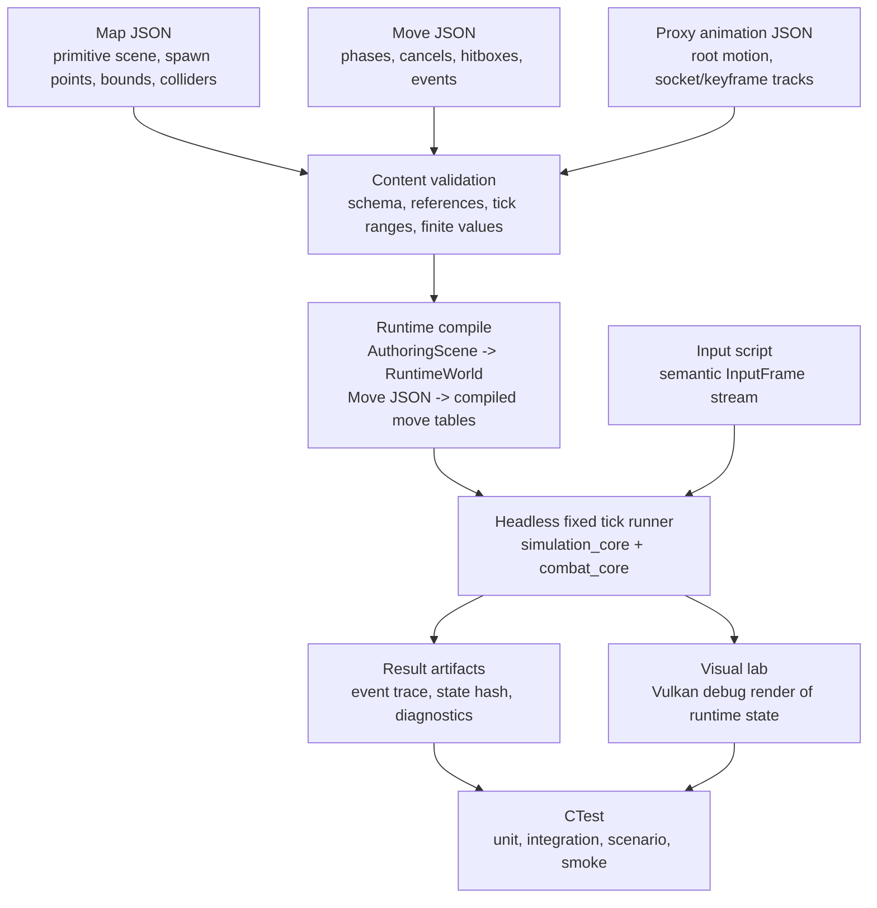

# Sprint 01 Implementation Plan: Map and Combat Authoring Loop

Source design: `docs/action_combat_engine_editor_design.md`

This sprint is the first real product slice. Its purpose is not to build the full editor or full engine. Its purpose is to make maps and combat moves designable, runnable, inspectable, and regression-testable as data.

The sprint theme is:

```text
author data -> validate/compile -> run fixed ticks -> inspect traces and debug visuals -> revise data
```

By the end of the sprint, we should be able to create a primitive combat map, define a few move timelines, run them headlessly, preview the result visually, and lock important behavior behind tests.

## Product Outcome

A designer/developer should be able to:

1. Define a primitive map with floor, obstacles, spawn points, world bounds, and a dummy target.
2. Define early move assets with startup, active, recovery, cancel windows, movement tracks, hit volumes, hurt volumes, and events.
3. Define simple keyframed animation/proxy socket tracks without needing full skeletal animation yet.
4. Run a deterministic scenario that loads map and move data, advances fixed ticks, and writes an event trace plus state hash.
5. Launch a visual lab/client mode that renders the map, actors, move debug windows, hitboxes, hurtboxes, root-motion paths, and interpolation samples.
6. Run the sprint suite through CMake and CTest without depending on PowerShell-only behavior.

## Guiding Decisions

### Data before UI

The first editable surface is versioned JSON plus validation errors. UI comes after the data model can be loaded, validated, simulated, and tested.

### Combat before full animation

The combat language should not wait for skeletal FBX import, GPU skinning, or socket editors. Sprint 01 uses proxy animation/keyframe tracks to prove timing, interpolation, root motion, and hit queries.

### Visual lab before full editor

The existing Vulkan viewer can evolve into a temporary combat/map lab. A full `game_editor` with docking, hierarchy, inspectors, asset browser, and undo can follow once the authoring/runtime data split is stable.

### Headless first, renderer second

Every gameplay rule added in this sprint needs a headless test path. Rendering is for inspection and debugging, not correctness.

### CMake and CTest are canonical

PowerShell may remain a local convenience wrapper, but sprint acceptance must run through CMake presets and CTest labels.

## Definition of Done

Sprint 01 is done when these are true:

- `cmake --preset msvc-debug`, `cmake --build --preset msvc-debug`, and `ctest --preset msvc-debug` work without required `.ps1` scripts.
- A command-line scenario runner can execute at least three checked-in combat scenarios and write structured result files.
- A primitive map schema can save/load/validate a small combat arena with spawn points and collision metadata.
- Move schema validation rejects invalid tick windows, unknown references, impossible empty cancel destinations, and malformed hitbox tracks.
- The combat runtime can execute light attack, dodge, and hit reaction examples in fixed ticks.
- Golden event traces cover hit, whiff, cancel-on-hit, and dodge-invulnerability boundary cases.
- Render frame cadence does not change the headless combat result.
- A visual debug mode shows primitive map geometry, actor transforms, hit/hurt volumes, root-motion/keyframe paths, and interpolation samples.

## Required Data Flow



## Sprint Tickets

### SP1-001: CMake and CTest Spine

Branch: `sprint01/sp1-001-cmake-ctest-spine`

Implement:

- Add `CMakePresets.json` with configure/build/test presets.
- Keep build directories stable and outside ad hoc script assumptions.
- Add CTest labels for unit, integration, network, viewer, and scenario tests.
- Make existing tests runnable through presets.
- Keep existing PowerShell scripts as optional wrappers only.

Test plan:

- Configure through preset.
- Build through preset.
- Run all existing tests through CTest preset.
- Confirm no required test path shells out through PowerShell.

### SP1-002: Common Host CLI and Result Files

Branch: `sprint01/sp1-002-host-cli-results`

Implement:

- Introduce shared command-line parsing for internal tools/hosts.
- Standardize common flags: `--frames`, `--ticks`, `--scene`, `--offline`, `--headless`, `--hidden-window`, `--result-file`, `--input-script`, `--command-script`, `--seed`, `--log-file`.
- Unknown options fail with usage text and nonzero exit.
- Result files are JSON and include status, seed, elapsed ticks/frames, logs/artifact references, and failure details.

Test plan:

- Unit test flag parsing and invalid combinations.
- Process test result-file success and failure paths.
- Viewer smoke still supports `--frames`.

### SP1-003: Characterization Before Extraction

Branch: `sprint01/sp1-003-characterization`

Implement:

- Capture current scene load behavior, floor bounds, actor spawn transforms, movement traces, interpolation behavior, packet encoding, relay behavior, and viewer smoke.
- Add fixtures for current bootstrap scene.
- Add tests that will fail if extraction changes current behavior accidentally.

Test plan:

- Scene fixture semantic compare.
- Movement input traces to final actor states.
- Interpolation transform tests.
- Existing network E2E still passes.
- `vulkan_scene_viewer --frames N` smoke under CTest.

### SP1-004: AuthoringScene v0 and Primitive Map Schema

Branch: `sprint01/sp1-004-authoring-scene-v0`

Implement:

- Add strong ID types for authored object IDs and runtime entity IDs.
- Add versioned map schema for primitives, transforms, material base color, colliders, spawn points, world bounds, and kill height.
- Add canonical load/save with deterministic ordering.
- Add validation diagnostics with file, object, component, and field path.
- Add compile path from `AuthoringScene` to `RuntimeWorld`.

Test plan:

- Round-trip map fixture.
- Reject duplicate IDs, invalid transforms, NaN/Inf, missing parents, invalid collider sizes, and missing spawn points.
- Compile primitive map to runtime and compare bounds/entity counts.

### SP1-005: RuntimeWorld and Fixed Tick Runner

Branch: `sprint01/sp1-005-runtime-world-fixed-tick`

Implement:

- Extract minimal `RuntimeWorld` state from the viewer-oriented scene/combat state.
- Add fixed tick runner with explicit tick count and deterministic time.
- Add semantic `InputFrame` stream separate from GLFW/XInput.
- Add state hash over gameplay-relevant fields.
- Add presentation interpolation helper independent of Vulkan.

Test plan:

- Same input stream produces same state hash across repeated runs.
- Simulation result is identical at render cadences of 30, 60, 144, and irregular frame times.
- Interpolation clamps and blends expected transforms.

### SP1-006: Move Schema v0 and Compiler

Branch: `sprint01/sp1-006-move-schema-compiler`

Implement:

- Add move asset schema with stable logical ID, duration, phases, input trigger, movement tracks, hitbox tracks, hurtbox overrides, cancel windows, resources placeholder, and events.
- Use half-open tick ranges `[begin, end)`.
- Compile JSON into runtime lookup tables.
- Intern move IDs, tags, event IDs, and track IDs.

Test plan:

- Valid light attack fixture compiles.
- Invalid tick ranges, unknown tags, unknown destination moves, duplicate track IDs, empty cancel targets, and zero-tick cycles fail with precise diagnostics.
- Compiled move tables do not depend on JSON object iteration order.

### SP1-007: Combat Runtime v0

Branch: `sprint01/sp1-007-combat-runtime-v0`

Implement:

- Add `CombatActorState` with active move, move tick, state tags, hitstop/stun counters, command buffer, and hit registry.
- Add command matching from semantic `InputFrame`.
- Add startup/active/recovery phase events.
- Add cancel checks for whiff, hit/block placeholder, always, and dodge.
- Add dodge and hit reaction as authored moves rather than hard-coded branches.

Test plan:

- Startup/active/recovery boundary tests.
- Input buffer tests.
- Cancel-on-hit and no-cancel-on-whiff scenarios.
- Hitstop/stun counter tests.
- Stable event IDs.

### SP1-008: Primitive Combat Collision v0

Branch: `sprint01/sp1-008-primitive-combat-collision`

Implement:

- Add primitive hit/hurt volumes: sphere, capsule, and box.
- Allow volumes to bind to root or proxy socket tracks.
- Add overlap checks and simple swept segment/capsule checks for fast weapon motion.
- Add stable hit ordering.
- Add once-per-target hit registry.

Test plan:

- Hitbox active only on intended ticks.
- Swept volume catches a crossed target between ticks.
- Multi-target order is stable across insertion order.
- Once-per-target prevents duplicate hits.
- Dodge invulnerability boundary test.

### SP1-009: Proxy Animation, Keyframes, and Interpolation

Branch: `sprint01/sp1-009-proxy-animation-keyframes`

Implement:

- Add a lightweight proxy animation asset for sprint experimentation.
- Support root-motion keyframes and named proxy sockets such as `weapon_base`, `weapon_tip`, and `chest`.
- Sample tracks by simulation tick.
- Add interpolation between keyframes for presentation.
- Keep this format explicitly temporary and compatible with later skeletal data.

Test plan:

- Keyframe sampling at exact ticks.
- Interpolation midpoint tests.
- Root-motion accumulation tests.
- Socket world transform tests.
- Same sampled pose is available headlessly and in the visual lab.

### SP1-010: Combat Scenario Runner and Golden Traces

Branch: `sprint01/sp1-010-scenario-runner-goldens`

Implement:

- Add `combat_scenario_runner`.
- Load map, actor setup, moveset/move assets, proxy animation tracks, and input script.
- Run fixed ticks headlessly.
- Emit ordered events, state hashes, and diagnostics.
- Add explicit golden update mode guarded by command option or environment variable.

Test plan:

- `sword_light_hits_idle_target`.
- `sword_light_whiffs`.
- `sword_light_cancel_on_hit`.
- `dodge_invulnerability_boundary`.
- Golden mismatch prints tick window and expected/actual events.

### SP1-011: Visual Map and Combat Lab

Branch: `sprint01/sp1-011-visual-combat-lab`

Implement:

- Add a visual mode to inspect sprint content using the existing Vulkan renderer path.
- Render primitive map geometry with base colors.
- Render actor root transforms, debug bounds, spawn points, hitboxes, hurtboxes, proxy sockets, root-motion path, and interpolation samples.
- Add pause, step tick, reset, and scenario playback controls if practical.
- Keep this separate from full editor document ownership.

Test plan:

- Smoke run with a scenario for fixed frames.
- Debug line buffer updates when stepping ticks.
- No networking initializes in offline lab mode.
- Vulkan validation smoke passes on the fixture.

### SP1-012: Command-Script Map Wireframing

Branch: `sprint01/sp1-012-command-script-map-wireframing`

Implement:

- Add a command-script runner for map authoring operations.
- Support new-from-template, create primitive, set transform, set base color, add collider, add spawn point, set bounds, save, reopen, compile, and play ticks.
- This becomes the first automation-friendly authoring path before GUI tools.

Test plan:

- Script creates a small arena, saves it, reopens it, compiles it, and runs 300 ticks.
- Undo/redo can be deferred, but command execution must be deterministic.
- Result file includes created object IDs and validation diagnostics.

## Minimal Content Fixtures

Create these checked-in fixtures during the sprint:

```text
tests/fixtures/maps/sprint01_test_arena.scene.json
tests/fixtures/moves/sword_light_1.move.json
tests/fixtures/moves/dodge.move.json
tests/fixtures/moves/hit_reaction_light.move.json
tests/fixtures/animations/sword_light_1.proxy_anim.json
tests/fixtures/scenarios/sword_light_hits_idle_target.scenario.json
tests/fixtures/scenarios/sword_light_whiffs.scenario.json
tests/fixtures/scenarios/sword_light_cancel_on_hit.scenario.json
tests/fixtures/scenarios/dodge_invulnerability_boundary.scenario.json
```

## First Combat Language Constraints

Keep Sprint 01 deliberately small:

- One actor resource set: health and stamina placeholders only if needed.
- One weapon proxy: training sword.
- One dummy target behavior: idle or scripted movement.
- One movement model: existing ground locomotion plus authored move displacement.
- One hit policy: once per target per move instance.
- One cancel category: cancel on hit/block placeholder and cancel always.
- One invulnerability rule: dodge window blocks strike hitboxes.

## Map Wireframing Constraints

Map design starts with primitives:

- Box floor/platforms.
- Box/capsule/cylinder blockers.
- Spawn points with facing.
- World bounds and kill height.
- Base colors only.
- Primitive colliders generated from primitive shape parameters.

Do not block map iteration on imported static meshes, textures, terrain, CSG, navmesh, or lighting.

## Animation and Keyframe Constraints

Sprint 01 animation is a combat-design tool, not a final animation system:

- Use proxy root and socket keyframes.
- Sample by simulation tick.
- Interpolate only for presentation or debug draw.
- Feed hitbox/socket queries from tick-sampled data, not render-frame interpolation.
- Preserve the later path to real skeleton clips, sockets, and GPU skinning.

## Test Matrix

| Area | Required sprint coverage |
|---|---|
| Build | CMake preset configure/build/test |
| Current behavior | scene, movement, interpolation, network, viewer smoke characterization |
| Map schema | load/save/validate/compile fixtures |
| Runtime world | deterministic fixed tick and state hash |
| Input | semantic `InputFrame` parsing and buffering |
| Move schema | valid compile plus invalid diagnostics |
| Combat runtime | phase, cancel, hit, dodge, stun/hitstop boundaries |
| Collision | primitive overlap/sweep and stable ordering |
| Proxy animation | keyframe sampling, interpolation, socket transforms |
| Scenario runner | golden traces and result files |
| Visual lab | fixed-frame Vulkan smoke with debug overlays |

## Non-Goals for Sprint 01

- Full Dear ImGui editor.
- Full asset registry/cook pipeline.
- Indexed mesh/material/texture renderer rewrite.
- Skeletal FBX animation import.
- GPU skinning.
- Weapon equipment replication.
- Authoritative combat networking.
- Prediction/reconciliation.
- Effects authoring beyond emitted event records.
- Terrain tools, CSG, navmesh, baked lighting.

## Recommended Ticket Order

```text
SP1-001 CMake/CTest spine
SP1-002 Common CLI/result files
SP1-003 Characterization
SP1-004 AuthoringScene v0
SP1-005 RuntimeWorld fixed tick
SP1-006 Move schema/compiler
SP1-009 Proxy animation/keyframes
SP1-007 Combat runtime
SP1-008 Primitive combat collision
SP1-010 Scenario runner/goldens
SP1-012 Command-script map wireframing
SP1-011 Visual combat lab
```

The order intentionally brings headless correctness online before visual tooling, while still delivering a visible map/combat lab inside the sprint.
